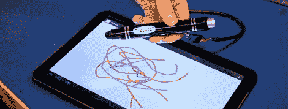

# 数字标记器与触摸屏通信

> 原文：<https://hackaday.com/2012/10/13/digital-marker-communicates-with-touch-screen/>

为了更贴近那些对蜡笔和记号笔不再感兴趣的孩子，克雷奥拉发布了 ColorStudio HD pen。这支笔不是墨水，而是充满了与平板电脑通信的电子设备，以便在 Crayola ColorStudio 应用程序中绘制不同的颜色。

[Rob Hemsley]以前做过一些电容式触摸屏的工作，所以当他听到笔内一个微型继电器的滴答声时，他自动知道它是如何工作的。当然，这意味着[拆开克雷奥拉标记器](http://www.robhemsley.co.uk/crayola_hack.html)来查看电子设备，但【Rob】还走得更远，替换了微控制器，允许你制作自己的 ColorStudio HD 笔。

数字克雷奥拉标记通过快速开关继电器与应用程序进行通信。这完成了用户的手和触摸屏之间的电路，允许平板电脑通过测量每秒接收的触摸次数来解释所需的颜色。

在笔内，[Rob]发现了一个 RGB LED、一个继电器和一个 PIC 微控制器。没有任何使用图片的经验，[Rob]将“micro”换成了 ATtiny44，并在 Arduino IDE 的帮助下开始编写一些固件。

[Rob]的更新版本的功能与普通版本完全一样，通过脉冲继电器指示选定的颜色来与 Crayola 应用程序通信。尽管 Crayola 应用程序只有三种可能的颜色，但[Rob]表示，对数字笔进行编程，将 RGB 颜色值发送到平板电脑是可行的，这样你就可以选择用什么颜色在笔上画画。

休息过后，您可以看到[Rob]更新钢笔的视频。

[https://player.vimeo.com/video/41602860](https://player.vimeo.com/video/41602860)