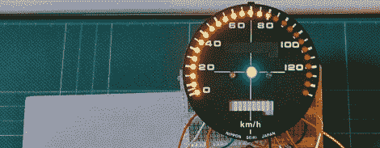

# 带 Arduino 的数字速度计

> 原文：<https://hackaday.com/2012/04/05/digital-speedometer-with-an-arduino/>

[Martyn]正在修复一辆使用了 32 年的本田摩托车，所以当去年旧的速度计损坏时，他认为现在是开始数字速度计项目的最佳时机。我们[很喜欢目前的结果](http://www.martyndavis.com/?p=311)，也很想在修复得很好的自行车上看到它。

相对于用一个 Arduino 驱动 40 个 LED 的恐惧，[Martyn]咬紧牙关，得到了一个 [Maxim 7221](http://www.maxim-ic.com/datasheet/index.mvp/id/1339) LED 驱动器。通过三线接口控制 64 个 led 在某种程度上简化了电路板设计，允许[马丁]用墨粉转移&HCl/H2O 2 方法蚀刻他自己的 PCB。为了实际供电和控制整个电路，[Martyn]使用了一个加载了基于[led control 库](http://arduino.cc/playground/Main/LedControl)的程序的 Arduino，使 spedometer 的编程变得轻而易举。

尽管这种泳裤很好用，[马丁]说他并不为它的外观感到自豪。我们不介意——糖果色跳线为这个项目增添了一份漂亮的气质，它们藏在速度计的面板后面。我们相信，一旦他得到了中性，远光灯，和警告指示灯与 LED 棒阵列/转速表一起工作，一切都会看起来很棒。

via [reddit](http://www.reddit.com/r/electronics/comments/rqu7c/building_a_digital_speedo_for_a_motorbike/)