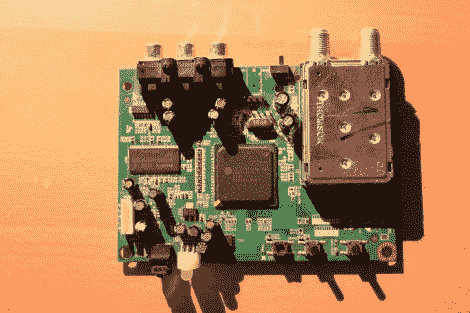

# 数字电视转换器逆向工程

> 原文：<https://hackaday.com/2012/08/01/digital-tv-converter-reverse-engineering/>

当广播电视首次从模拟转换到数字时，大多数人需要一个转换盒来观看数字电视广播。还记得那个恶心的“高清版”吗？这些电视可以显示高清信号，但实际上没有数字调谐器。现在所有的电视都配有一个，所以[克雷格]发现他的旧转换盒只是在积灰。所以他打开了它，并对数字电视硬件的工作原理进行了逆向工程。

硬件包括 Thompson 电视调谐器、遥控器的红外接收器和 LGDT1111 SoC 的支持组件。这是一个 LG 芯片，经过一番搜索后，[克雷格]拿到了一个框图，这给他一个探索的起点。转换器盒的制造商也很好，为 UART 提供了一个引脚头。它被填充，甚至在丝网上有标记的针。我们希望所有的硬件生产商都能这么善良。他通过终端获取所有他能获取的信息。这包括引导装载程序的转储、红外代码的读出等等。