# [Bil Herd]解释直接数字频率合成(DDS)

> 原文：<https://hackaday.com/2014/11/24/direct-digital-synthesis-dds-explained-by-bil-herd/>

你可能听到的首字母缩写之一是 DDS，它代表直接数字合成。DDS 非常简单，只需获取一个数字值(1 和 0 的集合)，然后通过数模转换器(DAC)电路进行处理。例如，如果数字源是一个计数器的输出，该计数器计数到最大值并复位，那么 DAC 的输出将是一个斜坡(模拟信号),其电压会增加，直到复位回到其起始电压。

这一概念对于创建项目中使用的信号或作为穷人版的信号或函数发生器非常有用。考虑到这一点，我在这里演示一些基本波形，使用可编程逻辑实现灵活性，并使用一组电阻作为廉价的 DAC。最后，我还将展示一款现成的廉价 DDS 芯片，它可以与任何支持 SPI 串行通信的流行微控制器板配合使用。

视频中涉及的所有主题也将在休息后进一步讨论。

[https://www.youtube.com/embed/MKiP-4o3cFI?version=3&rel=1&showsearch=0&showinfo=1&iv_load_policy=1&fs=1&hl=en-US&autohide=2&wmode=transparent](https://www.youtube.com/embed/MKiP-4o3cFI?version=3&rel=1&showsearch=0&showinfo=1&iv_load_policy=1&fs=1&hl=en-US&autohide=2&wmode=transparent)

[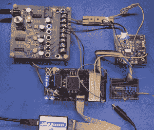](https://hackaday.com/wp-content/uploads/2014/11/image1.png)

DDS Demo Hardware

我选择使用可编程逻辑(PL)来构建各种电路，因为它可以快速配置，不需要太多的构建，同时又非常灵活。它也不需要任何软件编程、IDE、目标处理器板等。如果你有兴趣学习或练习一些基本的可编程逻辑技能，这可能是一个有趣的项目，这里我使用 Altera 的免费 Quartus II 网络版和一个便宜的程序员克隆。对于前几个例子，我使用的是复杂的可编程逻辑器件。(CPLD)

## 基本信号生成

[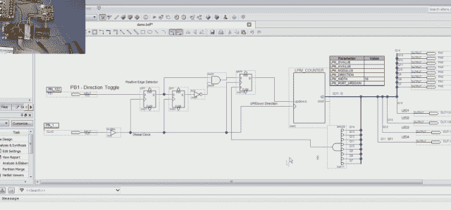](https://hackaday.com/wp-content/uploads/2014/11/altera1.png)

Altera CPLD DDS

也可以使用专用逻辑来创建波形，例如可以使用 CD4060 振荡器/计数器来代替 PL 计数器，或者也可以使用带有 I/O 端口的微控制器。请注意，微控制器版本从专用外设(如定时器或定时器/计数器)获得的帮助越多，性能就越好，定时器/计数器无需等待处理器响应和复位即可重新加载。

 [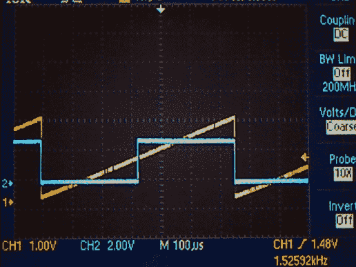](https://hackaday.com/2014/11/24/direct-digital-synthesis-dds-explained-by-bil-herd/image14/) DDS Ramp and Square Wave [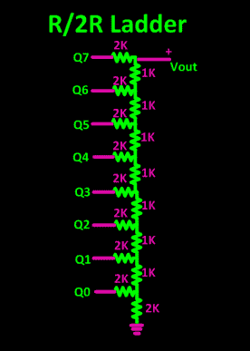](https://hackaday.com/2014/11/24/direct-digital-synthesis-dds-explained-by-bil-herd/capture-34/) R/2R Ladder

这是用一个简单的计数器和电阻组成的 R/2R 梯形电阻产生的两个波形。随着计数器的输出以二进制递增，由互连的电阻器和输出产生的分压器在每次计数之间产生一致的步长；由于使用了 8 个输出，在这种情况下为 256。取最高有效位也证明了对称方波。

## 构建不同的信号很容易

如果计数器在达到其最大计数时向下计数，而不是重置为零，那么将产生三角波形。到目前为止，仅用一个计数器和一些电阻就有三个波形。

 [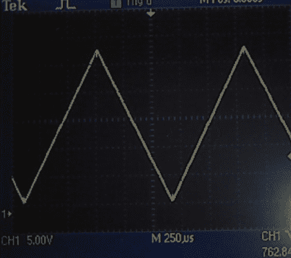](https://hackaday.com/2014/11/24/direct-digital-synthesis-dds-explained-by-bil-herd/image12/) Triangle Waveform DDS [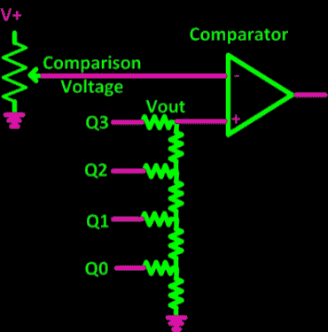](https://hackaday.com/2014/11/24/direct-digital-synthesis-dds-explained-by-bil-herd/1-18/) R/2R Ladder with Comparator

另一个稍微不同的话题是，只需使用一些 I/O 线、一个 R/2R 梯形电阻和一个模拟比较器(ala LM339)，就可以制作一个基本类型的模数转换器(ADC)。不要误解这一点，我们之前谈论的是从数字到模拟，但现在我们谈论的是从模拟到数字。

简单地说，处理器或数字计数器连接到 R/2R 梯形电阻，该电阻连接到模拟比较器的输入端。然后，将待测电压连接到比较器的另一个输入端，然后计数器开始向上计数，直到 R/2R 梯形电压等于或超过待测电压。此时，比较器跳闸，被测模拟电压的等效数字值由馈入 R/2R 梯形电阻的计数器值表示。

假设要测量的电压有些稳定，可以重复该过程来跟踪(缓慢)变化的电压，或者可以反转计数，直到比较器清零，然后反转。这对于诸如监控电池电压水平等测量可能是有用的。

在继续使用附加比较器的同时，可以通过在比较器跳闸时改变计数器的方向来实现简单的电压频率转换器。这不是一个完美的转换器(我做的事情没有一件是完美的，生活和工程是一种妥协),因为非常明显的是，三角波形的幅度会发生变化，但一个完整的电压方波很容易产生。

## 正弦波产生的基本原理

[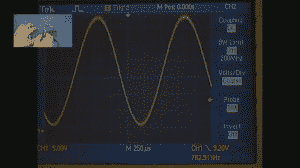](https://hackaday.com/wp-content/uploads/2014/11/image7.jpg)

DDS Sinewave

最后，我们可以通过添加一个包含适当数据的查找表来创建一个正弦波，以逼近一个数学正弦函数。查找表(LUT)只是一块与数据串联的存储器，例如只读存储器(ROM ),在我们的情况下，递增计数器代表递增地址，数据输出是预先计算的正弦表的结果。

为此，我改用了现场可编程门阵列(FPGA ),它具有更好的内部存储器，能够用我为 LUT 创建的正弦表的内容初始化存储器。在我的 FPGA 内部原理图中，可以看到 LUT 在输出引脚正前方的右侧。

[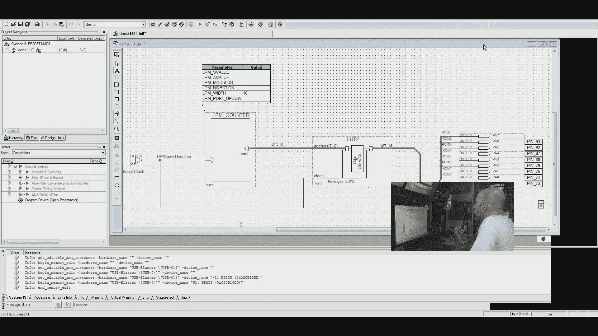](https://hackaday.com/wp-content/uploads/2014/11/image16.jpg)

FPGA w LUT

## 复杂波形编程

DDS 产生的正弦波的一个优点是，它可以在很宽的频率范围内产生，并保持相同的形状(低失真)。

只是为了好玩，也为了演示用 DDS 可以轻松完成的事情，我制作了一个非对称波形。仔细观察，可以看到两个方波周期、两个斜坡周期和两个正弦波周期。任何可以在内存中“画”出来的波形都可以用这种方法创建。

[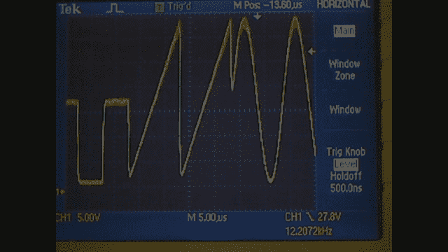](https://hackaday.com/wp-content/uploads/2014/11/image8.jpg)

Square-ramp-sine

## 其它 DDS 硬件选项

最后，如果您需要一个 DDS，而不需要自己动手制作器件，那么有一系列低成本、高精度的 DDS 器件可供选择。此处显示的是制造商 ADI 公司的评估板 9387。它由 SPI 串行接口驱动，因此可以连接到大多数可用的单板控制器。

[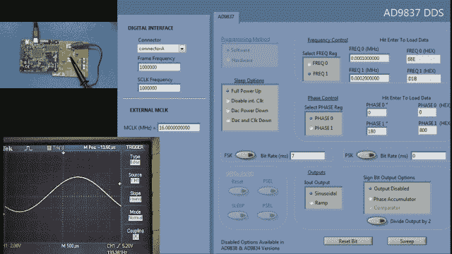](https://hackaday.com/wp-content/uploads/2014/11/image11.jpg)

DDS Eval AD9837

通过微处理器控制来改变信号的频率和相位是 DDS 系统不可或缺的一部分。评估板附带的软件显示，可以存储两个频率和两个相位偏移，允许[频移键控](http://en.wikipedia.org/wiki/Frequency-shift_keying) (FSK)和[相移键控](http://en.wikipedia.org/wiki/Phase-shift_keying) (PSK)以及在两个频率之间扫描。这是一项有用的功能，例如，可以通过扫描输入端的频率，然后在示波器上测量输出来观察滤波器等电路的频率响应。

[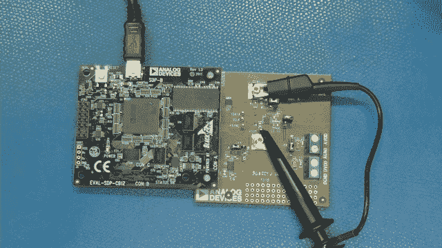](https://hackaday.com/wp-content/uploads/2014/11/image10.jpg)

Eval 9837

## 深入一点

如果您想了解更多有关 DDS 的信息，可以在制造商网站和互联网上找到。要搜索的高级主题包括嵌入式子调制和与锁相环一起使用以降低相位噪声、使用乘法器的上变频以及 RF 电信中使用的其它合成电路。