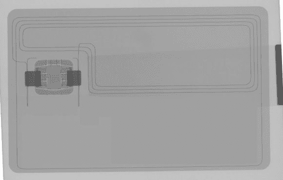

# 禁用 Tap 支付借记卡

> 原文：<https://hackaday.com/2014/08/23/disabling-tap-to-pay-debit-cards/>

有些人对 RFID 信用卡和借记卡的热潮不太感冒，问题是，如果银行发给你一张新卡，你真的没有选择得到什么卡！好吧，如果你真的不喜欢你卡上的这个，不管是什么原因，很容易禁用它。

[詹姆斯·威廉森]最近拿到了一张新的带 RFID 技术的借记卡——问题是它在工作时干扰了他的门禁卡，读卡器会哔哔两声，有时不工作。他决定禁用它，因为他并没有真正使用 tap to pay 功能，也没有完全相信它像银行所说的那样安全。

由于这些 RFID 芯片使用铜线制成的天线，他可能刚开始用刀切他的卡来破坏天线——但是，由于他可以使用 CT 扫描仪，他认为他应该扫描它以找出所有东西的位置。

只需在卡片边缘做一个小切口，或者剪去一角。当靠近阅读器时，这将破坏天线并阻止芯片通电——尽管如果你没有 CT 扫描仪，下次买东西时你可能要仔细检查一下！

现在还有另一面——也许你实际上喜欢整个点击支付的事情，嗯，如果你想你可以得到一个补充卡，[溶解在丙酮](http://hackaday.com/2012/07/17/store-your-rfid-transit-card-inside-your-cellphone/)中，然后将 [RFID 芯片安装到一个戒指](http://hackaday.com/2014/03/16/stuffing-an-rfid-card-into-a-finger-ring/)中，以获得绝地武士般的购买力！