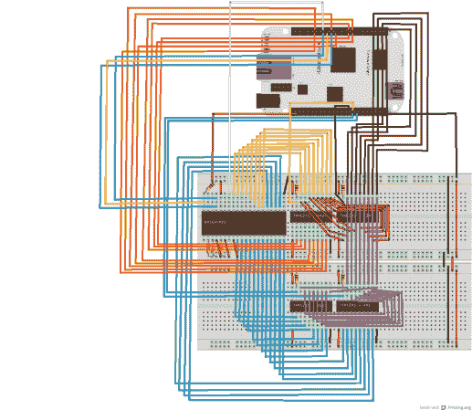

# 分立的 6502 处理器被小猎犬骨吸进了 Linux

> 原文：<https://hackaday.com/2012/11/20/discrete-6502-processor-sucked-into-linux-by-a-beaglebone/>

通常，当我们看到使用嵌入式 Linux 的项目时，我们认为它们不是硬件黑客。但这是一匹完全不同颜色的马。[Matt Porter]正在利用一个鲜为人知的特性从 Linux 环境内部直接访问 6502 处理器。换句话说，这种技术允许你为 6502 处理器编写代码，然后从同一个 Linux shell 中加载并执行这些代码。

该项目利用了 BeagleBone 的最佳部分，beagle bone 是运行嵌入式 Linux 的 ARM 开发板。它有许多 GPIO 引脚，很容易通过电路板引脚插座获得。处理器的设计使得它足够快，可以作为 6502 芯片的主机。这就把我们带回到这是如何做到的。Linux 内核支持远程处理器，这是 Matt 走过的路。一切就绪并对内核做了大量调整后，他能够将芯片映射到/dev/bvuart 目录。如果你想了解所有细节，最好的资源是[这组幻灯片](http://elinux.oimg/a/ac/What%27s_Old_Is_New-_A_6502-based_Remote_Processor.pdf) (PDF)，来自他在欧洲嵌入式 Linux 大会上的演讲。

这是摆脱所有硬件工作的一种方式，奎因·邓基一直在围绕 6502 芯片建造她自己的计算机。

[感谢安德鲁通过[危险原型](http://dangerousprototypes.com/2012/11/19/6502-remote-cpu-on-a-beaglebone/)