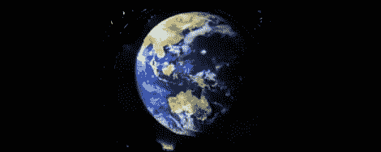

# 在气泡表面显示图像

> 原文：<https://hackaday.com/2012/09/03/displaying-images-on-the-surface-of-bubbles/>

你在上面看到的图像不是我们从数千英里高空拍摄的蓝色大理石的简单照片。不，那张图片比卫星酷多了，因为它是地球在肥皂电影屏幕上的投影。是的，我们现在可以在气泡表面显示图像。

这个项目使用糖、甘油、肥皂、表面活性剂、水和牛奶的混合物来生产一种比标准肥皂泡更耐爆裂的薄膜，而不是通常给小孩子的肥皂泡。通过这些薄膜照射图像不会产生太多图像，所以研究人员使用超声波扬声器来振动薄膜，使其有可能显示图像。

使用一个小型投影仪，该系统可以在气泡表面显示图像。当然，现在显示区域很小，但是随着实验的继续，这个尺寸很可能会增加。

休息过后，你可以观看一大堆演示这项技术的视频。

[https://www.youtube.com/embed/HUQlK6lga0I?version=3&rel=1&showsearch=0&showinfo=1&iv_load_policy=1&fs=1&hl=en-US&autohide=2&wmode=transparent](https://www.youtube.com/embed/HUQlK6lga0I?version=3&rel=1&showsearch=0&showinfo=1&iv_load_policy=1&fs=1&hl=en-US&autohide=2&wmode=transparent) [https://www.youtube.com/embed/tvxJs_4m0ZE?version=3&rel=1&showsearch=0&showinfo=1&iv_load_policy=1&fs=1&hl=en-US&autohide=2&wmode=transparent](https://www.youtube.com/embed/tvxJs_4m0ZE?version=3&rel=1&showsearch=0&showinfo=1&iv_load_policy=1&fs=1&hl=en-US&autohide=2&wmode=transparent) [https://www.youtube.com/embed/UoG6WD90xbQ?version=3&rel=1&showsearch=0&showinfo=1&iv_load_policy=1&fs=1&hl=en-US&autohide=2&wmode=transparent](https://www.youtube.com/embed/UoG6WD90xbQ?version=3&rel=1&showsearch=0&showinfo=1&iv_load_policy=1&fs=1&hl=en-US&autohide=2&wmode=transparent)