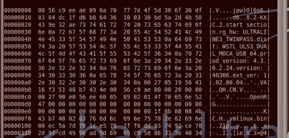

# 剖析固件映像

> 原文：<https://hackaday.com/2013/02/22/dissecting-a-firmware-image/>

[利兰·弗林]做了一件伟大的工作[为一台 Westell 9100EM FiOS 路由器](http://this8bitlife.com/adventures-in-linux-reverse-engineering-firmware/)分离固件映像。不幸的是，他实际上并没有找到他要找的信息。但是他也还没有完全调查完。如果您从未尝试理解嵌入式 Linux 固件映像，那么这是一个很好的初学者示例，说明了如何理解。

在端口扫描他的外部 IP 并发现一个随机的登录提示后，他开始了这个项目，当然这不是他设置的。一些搜索让他相信这是威瑞森向他的路由器推送自动固件更新的某种后门。他想，为什么不试试看能不能把证件拽出来，然后在机器里翻来翻去？

他从下载最新的固件升级开始。运行“hexdump”和“strings”可以让他确认映像是基于 Linux 的。然后，他可以拆开这个包，只得到文件系统部分。他坚持不懈地提取和解压缩三个不同的文件系统。尽管他现在可以访问所有这些文件，但断开的符号链接意味着他的登录搜索走进了死胡同。