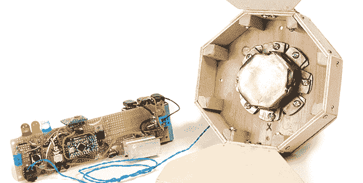

# DIY 安全气囊，含爆款

> 原文：<https://hackaday.com/2013/07/14/diy-airbag-explosions-included/>

你汽车的安全气囊是汽车工业的主要工程成就之一。在事故中，为了防止你的脸撞到方向盘，一系列的过程必须按顺序进行，而且所有的事情都必须在几分之一秒内发生。Make 公司的[Steve]认为这是一个很酷的想法，可以发现用安全气囊拯救生命的真正原理，并决定自己制造一个。

该建筑的电子设备包括一个加速度计和一个 Arduino。大量的研究、开发和实验已经进入触发安全气囊的算法，但[史蒂夫]决定让事情变得简单:当检测到突然加速时，引爆少量黑火药。

安全气囊本身是用帆布加固的防撕裂尼龙，装在一个装有铰链门的木制小盒子里。所有这些组件都被放在轮式铝制测试台上，配备一个蜜瓜碰撞测试假人，以每小时几英里的速度拉进一堵短墙。

尽管[史蒂夫]没有投入成千上万的工时来开发他的安全气囊——不像你在方向盘上看到的那样——他的装置实际上工作得相当好。虽然没有取得完全的成功，但他确实想出了一种东西，它的外观和行为都像人们熟悉的拯救了无数生命的设备。