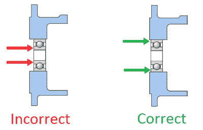

# DIY 汽车车轮轴承拉具

> 原文：<https://hackaday.com/2015/03/21/diy-car-wheel-bearing-puller/>

汽车是最伟大的。大多数时候，他们会带你去你想去的地方。如果某个关键部分出现故障，他们也会在最糟糕的时刻让你失望。当我们开车时，车轮轴承有很多用处，[Dmitry]发现了它们失效的速度有多快。他没有对此感到烦躁，而是着手自己更换损坏的轴承。在这个过程中，他做了一个非常漂亮的 DIY 轴承拔出器。

一些车轮轴承，例如 2WD 卡车前部的轴承，仅由一个大螺母固定，很容易从主轴上滑落。对于[德米特里的] AWD 斯巴鲁的后部来说，情况并非如此。后轴承压配合到轴承箱中。这些很难移除，因为轴承的外径实际上只是稍微大于轴承箱的内径。这种将零件保持在一起的方法称为“[过盈配合](http://en.wikipedia.org/wiki/Interference_fit)”。

[Dmitriy]的小工具使用 Hackaday 最喜欢的简单机器之一，[螺钉](http://en.wikipedia.org/wiki/Screw_(simple_machine))，慢慢地将轴承从外壳中推出。它的工作原理是将一根螺杆穿过轴承和轴承座。每侧都安装了一个大垫圈和螺母，以及一个为螺杆提供支撑的 PVC 管垫片。拧紧相对的螺母时，一个垫圈压在轴承上，轴承慢慢滑出外壳。新轴承的安装是相同的，除了反向工具将衬套压入外壳。

当将轴承压入紧密的轴承座时，重要的是只压在外圈上。相反，将轴承压到轴上时，重要的是只压内圈。这样，施加的轴向载荷不会通过轴承滚珠或滚柱传递。这确实会损坏轴承，导致过早失效。[Dmitriy]通过在拆卸和安装过程中使用与轴承外圈接触的适当尺寸的垫圈进行处理。

下图显示了将轴承装入轴承箱的正确和错误方法。在左图中，按压内座圈将会“挤压”滚珠，因为内座圈想要进入，而外座圈想要停留在原位，因为外座圈和轴承箱之间由于干涉配合而存在阻力。在右图中，按压外圈不会在滚珠上施加任何载荷或应力，并且会产生正确安装、无损坏的轴承。