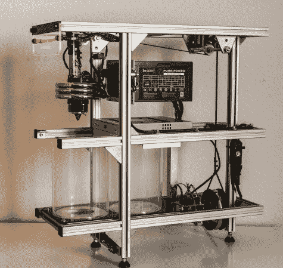

# DIY 光盘自动加载器

> 原文：<https://hackaday.com/2013/10/05/diy-cd-autoloader/>

来自德国黑客空间 Ffm 的这款[极其健壮的 DIY 光盘自动加载器](http://hackerspace-ffm.de/wiki/index.php?title=DIY-Autoloader) ( [翻译](http://translate.google.com/translate?sl=auto&tl=en&js=n&prev=_t&hl=en&ie=UTF-8&u=http%3A%2F%2Fhackerspace-ffm.de%2Fwiki%2Findex.php%3Ftitle%3DDIY-Autoloader))！我们希望你的德语不会太生疏…

[David]厌倦了手工复制他的 CD 收藏，所以他着手制作一个开源的 DIY 光盘自动加载器。他的第一个原型[是这个](http://www.youtube.com/watch?v=2U8RGKXI6t0)，我们必须承认它很时尚(它使用了一个游戏 PC 塔作为外壳)。

他的项目目标之一是简单，考虑到这一点，他创建了一个无人驾驶的解决方案，使用机械致动器来做一切事情——你所要做的就是将你的计算机插入驱动器。它利用一个取自笔记本光驱的夹子和一系列配重来拾取和存放磁盘。框架由铝挤压制成，主要的功能支架都是 3D 打印的。

为了看到它的实际效果，请在休息后留下来。我们个人很喜欢后面配重滑轮的使用！

[https://www.youtube.com/embed/O6toB3w7e_Q?version=3&rel=1&showsearch=0&showinfo=1&iv_load_policy=1&fs=1&hl=en-US&autohide=2&wmode=transparent](https://www.youtube.com/embed/O6toB3w7e_Q?version=3&rel=1&showsearch=0&showinfo=1&iv_load_policy=1&fs=1&hl=en-US&autohide=2&wmode=transparent)

如果你碰巧有足够多的 CD 收藏，他已经在维基上发布了所有的文件(第一个链接)。