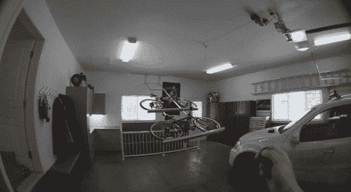

# DIY 天花板支架让您的自行车远离干扰

> 原文：<https://hackaday.com/2014/02/22/diy-ceiling-rack-keeps-your-bikes-out-of-the-way/>

需要优化车库的一些空间吗？为什么不建造一个安装在天花板上的绞盘辅助[自行车架呢！](https://www.youtube.com/watch?v=Ds7GbJtfRTs)

[Mathieu]已经有了一个相当宽敞的车库，但想让它更有条理。他用 1 英寸见方的铝管制作了自行车架，并用螺栓固定在一起(不需要焊接！).自行车坐在铝制 U 形槽中，以固定到位。整个机架铰接在后壁上，一个滑轮系统使用一个小 ATV 绞车提升和降低机架，以便于访问自行车。

它目前由 12V 摩托车电池供电，他计划给它添加一个涓流充电器——也就是说，它已经持续了 6 个多月，他仍然没有给它充电！他拼凑了一个小小的控制电路，包括两个继电器(向上和向下)和一个双通道遥控器。这台发动机有点慢，但它运转得很好。如果他想让它跑得更快一点，他可能会把电压提高一倍，让它跑得更快——因为它只开了很短一段时间，所以应该没问题。看到这样的黑客，我们不禁想知道，在一个单独的住所里，你能建造多少个绞盘驱动的额外装置。

看看下面的视频吧！

[https://www.youtube.com/embed/Ds7GbJtfRTs?version=3&rel=1&showsearch=0&showinfo=1&iv_load_policy=1&fs=1&hl=en-US&autohide=2&wmode=transparent](https://www.youtube.com/embed/Ds7GbJtfRTs?version=3&rel=1&showsearch=0&showinfo=1&iv_load_policy=1&fs=1&hl=en-US&autohide=2&wmode=transparent)