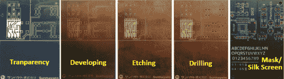

# DIY 电路板看起来很专业

> 原文：<https://hackaday.com/2014/07/15/diy-circuit-boards-look-professional/>

在家制作 PCB 是一种很好的方式，可以让你的原型启动并运行，而不必为专业制作的电路板等待数周。无论这些原型板是经过打磨还是蚀刻，由于其“未完成”的外观，它们很容易被识别为“自制”。[HomeDIY&Stuff]整理了一点制作方法，让 DIY PCBs 看起来更接近专业制造的电路板。

该流程从在 PCB 程序中设计电路板开始。有很多这样的程序可用。Eagle 是一个受欢迎的选择，有一个免费版本。一旦布局最终确定，设计就被打印在一张透明的塑料纸上。本例中使用的空白覆铜 PCB 板已经涂有紫外线敏感涂层，可供购买。将透明片放在 PCB 坯件上，然后暴露在紫外光下。PCB 上的涂层在紫外光穿过透明体的开放区域时固化。

一旦去除透明物，涂层固化后的颜色会有明显的不同。现在将该板放入显影剂溶液中，除去未固化的紫外线敏感涂层。然后氯化铁酸浴蚀刻掉现在暴露的铜。来自前一步骤的固化涂层在蚀刻过程中保护迹线位置处的铜。结果是，你想要的地方有铜，不需要的地方没有铜。如果电路板有任何通孔元件，这将是钻这些孔的时候。

到目前为止，这个过程对于自制 PCB 来说是相当标准的，接下来的部分肯定是最有趣的，但不幸的是，也是最糟糕的记录步骤；阻焊膜和丝网印刷。似乎产生了两个丝网，一个用于阻焊膜，一个用于丝网。可以从 PCB 设计软件中输出用于制作丝网的图形。没有提及所使用的阻焊材料，但是规定了油基丝网油墨。虽然缺乏细节，但照片显示它工作得相当好。如果你有过丝网印刷 DIY PCBs 的经验，请在评论中告诉我们。