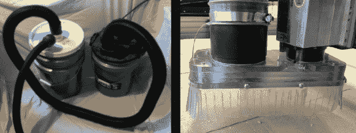
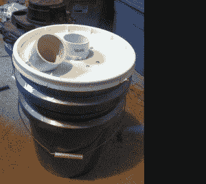
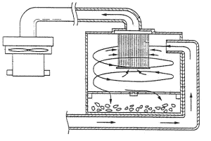
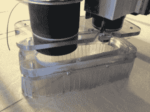

# DIY 数控除尘真的很烂！

> 原文：<https://hackaday.com/2014/03/23/diy-cnc-dust-collection-really-sucks/>

CNC 路由器很棒。如果你曾经使用过，你会知道这一点，但你也知道他们会覆盖一层灰尘的机器和周围的一切。当然可以使用商店真空吸尘器来吸走路由器上的灰尘，但是，唯一的问题是商店真空吸尘器的过滤器会被灰尘堵塞，失去吸力，破坏了你的真空吸尘器系统的意图。

 【迈克道格拉斯】准备加紧自己的数控游戏，决定自己做[尘埃](http://dbugslife.blogspot.com/2014/03/thein-baffle-cyclone-separator.html)  [分离器](http://dbugslife.blogspot.com/2014/03/thein-baffle-cyclone-separator.html) 。这个设计非常简单，只使用了几个 5 加仑的水桶，几个 PVC 配件和几块木头。为了保持低成本和高格调，配套的“商店真空吸尘器”也是由 5 加仑的桶制成，带有一个真空盖。该项目是有据可查的，所以去他的网站看看构建过程。

灰尘分离器正如它的名字所暗示的那样，它在空气进入真空之前将灰尘和碎片从空气中分离出来。下图显示了它的工作原理:首先，真空在灰尘分离器内部产生低压。低压将充满灰尘的空气吸入灰尘分离器。进气管引导进入的空气与圆形室相切。大的碎片快速下落通过挡板并进入收集室。当分离器旋转时，灰尘进入并被甩到分离器壁上。当灰尘绕着分离器的圆周运动时，重力将它拉下进入收集室。现在清洁得多的空气通过出口向上进入真空吸尘器。

现在我们有了一个灰尘分离器，你愿意站在你的数控机床旁边拿着真空软管收集新产生的灰尘吗？大概不会。[Gerg]也没有，这就是为什么他为他的商店机器人做了一只[防尘鞋](http://www.instructables.com/id/Magnetic-ShopBot-Dust-Skirt/?ALLSTEPS)。它是由商店里的废弃聚碳酸酯制成的。该设计有两个主要组成部分，连接到路由器的顶部和具有裙部的底部。底部用磁铁连接到顶部，这样可以快速移除裙部，从而可以轻松更换刀头。如果你想制作自己的防尘鞋，[Gerg]提供了 dxf 文件。

