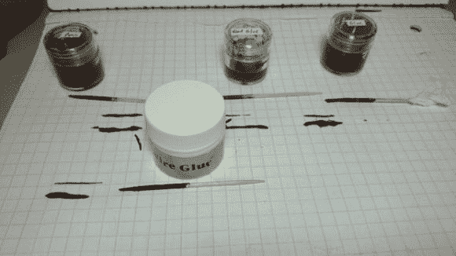

# DIY 导电涂料满足您所有的穿戴需求

> 原文：<https://hackaday.com/2014/07/23/diy-conductive-paint-for-all-your-wearable-needs/>

导电墨水或涂料很有趣。它为灵活和独特的电路开辟了无数可能性——不幸的是，它相当昂贵。[Brian McEvoy]向我们展示了如何以低廉的价格制作自己的产品，而且效果非常好！

在尝试了其他可指导的指南和市场上可买到的颜料后，他开始尝试制定自己的配方，他发现其实并没有那么复杂！石墨粉、丙烯颜料和一个密封的罐子——说真的，就这么简单！但是，像任何称职的工程师一样(他称自己为 [24 小时工程师](http://24hourengineer.blogspot.ca/)，他必须做一些测试来比较他的公式。

在一个详细的实验中，他将他的配方与市场上可买到的[钢丝胶](http://www.thinkgeek.com/product/b70c/?srp=2)，以及另外两个使用 Elmer's Glue-All 和石墨以及 Titebond III 和石墨的配方进行了比较。结果呢？丙烯酸涂料和石墨是最导电的材料，也是最便宜的！

既然你可以制造导电墨水，为什么不 3D 打印一个电路印章来制作你自己的 SMD 电路板呢！