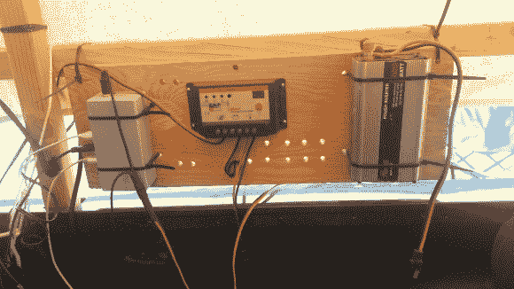

# DIY 电和互联网为燃烧的人

> 原文：<https://hackaday.com/2013/09/12/diy-electricity-and-internet-for-burning-man/>

尽管这是肯尼斯·芬尼根的第一个燃烧的人，这家伙还是做好了准备，并通过建立强大的电力供应和微弱但功能正常的互联网连接保持联系。如果你看过[【肯尼斯】的《燃烧的人》幻灯片](http://hackaday.com/2013/09/05/kenneth-finnegans-epic-burning-man-slideshow/ "[Kenneth Finnegan's] EPIC Burning Man slideshow")，你就会知道沙漠只是对电力、水甚至临时跑道的温和威慑。

他从加州理工学院借了一块 20V 100W 的太阳能电池板，并在易贝买了一个廉价的 TSMT-20A 太阳能充电控制器。控制器通过防止过度充电和过度放电来保护电池。电池——两个 Trojan-105 220Ah 6V 的庞然大物——在生命的最后阶段一瘸一拐地从剪式升降机中出来:高内阻排除了大电流消耗。幸运的是，电力需求很低，因为大多数设备都是 12VDC 或 USB。[Kenneth]也在今年早些时候方便地[制作了这个 USB 插线板](http://hackaday.com/2013/02/22/build-your-own-dumb-usb-power-strip/ "Build your own dumb USB power strip"),他带着它来降压到 5VDC，用于 USB 充电。

然而，沙漠中的互联网不太可靠。一个小团队每年夏天提供来自文明的微波链接，通过 3 个不同营地的开放接入点共享。[Kenneth]将他的 [Ubiquiti NanoStation](http://www.ubnt.com/nanostation) 指向最近的一个，它提供了许多不方便的怪癖和 2-20kBps 的最高速度:至少足以检查电子邮件。