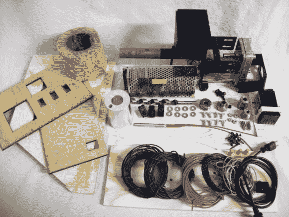

# DIY 细丝:细丝机器人 Wee

> 原文：<https://hackaday.com/2013/11/22/diy-filament-the-filabot-wee/>

现在，制作自己的 3D 打印机灯丝又有了一种选择:[fila bot Wee。](http://makezine.com/projects/guide-to-3d-printing-2014/diy-filament-extruder/)看起来他们今年早些时候从 Thinigiverse 获得的曾经的[开源模型](http://www.thingiverse.com/thing:24583)已经得到了重大改造，尽管我们不确定哪些部分可能发生了变化。(*编辑: [Filabot 表示，Wee 仍然是开源的，一旦他们更新了文件，它们将再次可用。](http://hackaday.com/2013/11/22/diy-filament-the-filabot-wee/#comment-1114922)* )

正如您所料，Wee 有一个 PID 温度控制器，能够将 ABS 和 PLA 粒料挤出成 1.75 毫米或 3 毫米直径的长丝。速度取决于材料和厚度，但可以达到每分钟 5 至 20 英寸的长丝挤出。尽管 Filabot 团伙将挤出机作为一个套件出售，但如果你有激光切割机和其他一些基本材料，你可能会节省一些钱。

你应该预料到 Filabot 零件的花费(649 美元)会比最初的莱曼挤压机(T1)多，尽管更公平的比较可能是莱曼挤压机(T3)的新[第三版，其材料清单接近 900 美元。考虑到莱曼最近的评论表明，挤压率为每分钟 40-50 英寸，额外的美元可能是值得的。休息之后，你可以看看 Filabot Wee 的演示视频。](http://www.thingiverse.com/thing:145500)

[https://www.youtube.com/embed/712nrXmdkIg?version=3&rel=1&showsearch=0&showinfo=1&iv_load_policy=1&fs=1&hl=en-US&autohide=2&wmode=transparent](https://www.youtube.com/embed/712nrXmdkIg?version=3&rel=1&showsearch=0&showinfo=1&iv_load_policy=1&fs=1&hl=en-US&autohide=2&wmode=transparent)