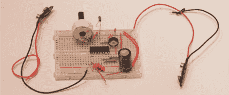

# DIY 弗拉纳根脑听器让你听到超声波

> 原文：<https://hackaday.com/2012/08/07/diy-flanagan-neurophone-lets-you-hear-with-ultrasound/>

[Andreas]来信让我们了解这个 DIY 脑听器项目。显然，弗拉纳根脑听器以某种方式使用超声波将音频直接传输到身体或神经系统？不用说，我们对任何维基页面直接指向金字塔权力的人都有点怀疑。事实上，大部分关于这件事的参考资料都开始漫谈一些非常伪科学的理论。

无论如何，这个示意图对任何有零件的人来说都是足够清晰和简单的。唯一的挑战可能是用信号发生器或音频馈送来调谐这个东西。怎么样，有没有人有 TL494 脉宽调制控制器，想当试验品？