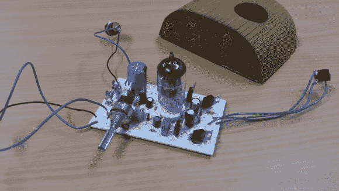
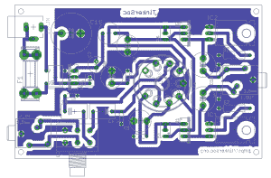

# DIY 耳机电子管放大器基于现有设计

> 原文：<https://hackaday.com/2014/07/03/diy-headphone-tube-amp-builds-on-existing-design/>

[西蒙]来信告诉我们他刚刚制作的一款耳机电子管放大器。它是基于 diyaudioprojects.com 的[的示意图，实际上是过去](http://diyaudioprojects.com/Solid/12AU7-IRF510-LM317-Headamp/) [Hackaday](http://hackaday.com/2010/04/13/tiny-tube-amp-for-headphones/) 的特色。[Simon 的]设计增加了板载稳压电源和输入音量控制。努力保持 PCB 单面，以便于在家里制作。

12au 7 因其耐用性和对低工作电压的耐受性而广受欢迎。这种放大器设计使用 12 的板电压，尽管 12AU7 可以处理高达约 330。由于 12AU7 是双三极管类型，一个电子管可以用来放大左右声道。

放大器的外壳是激光切割的胶合板。顶部被切角，以便它可以围绕前后面板的半径弯曲。顶部也有一个洞，让管子可以从中窥视。这些零件看起来不错，但不幸的是，他没有展示组装状态下的外壳和放大器。

如果你有兴趣建一个，西蒙提供了所有的鹰和案例文件。该项目的总成本为 25 英镑，约合 43 美元。要了解更多关于电子管放大器的工作原理，请查看今年早些时候的这个[retro techular](http://hackaday.com/2014/01/07/retrotechtacular-tube-amplifiers/)。