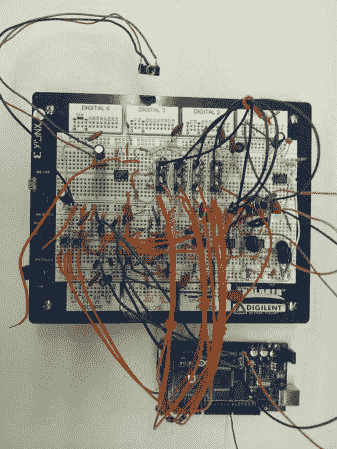

# DIY 助听器

> 原文：<https://hackaday.com/2013/12/15/diy-hearing-aid/>

助听器是昂贵的小设备，通常每个要花费几千美元。它们需要高度集成以适合耳朵，同时仍然提供信号处理以确保良好的音频质量。

这个 [DIY 助听器](http://www.instructables.com/id/Intelligent-Hearing-Aid/?ALLSTEPS)做一些智能信号处理。它使用驻极体来捕捉音频，然后使用前置放大器将增益提高 100 倍。下一级由四个滤波器组成，将输入信号按频率分成四部分。这些信号被传递到四个 [LTC6910](http://www.linear.com/product/LTC6910) 可编程增益放大器，这使得 Arduino 可以控制每个通道的增益。LTC6910 采用 3 路数字输入，用于设置增益值。

要确定每个频段使用的增益，Arduino 需要知道每个频段的功率有多少。这可以通过快速傅立叶变换来实现，但这需要相当大的处理能力。相反，[包络检测器](http://en.wikipedia.org/wiki/Envelope_detector)对信号进行平均，可以通过 Arduino 上的模拟输入读取。利用这些信息，助听器可以在检测到对话时提高特定频率。

这个助听器不太适合你的耳朵，但是有很多有趣的信号处理在进行。提供了原理图、Arduino 源代码和 MATLAB 仿真。