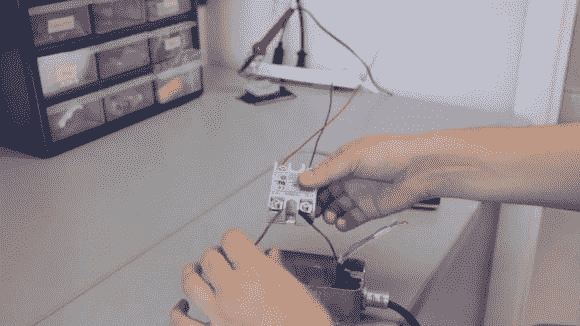

# 使用 SSRelay 进行 DIY 家居控制

> 原文：<https://hackaday.com/2013/11/26/diy-home-control-using-a-ssrelay/>

[Ben Jones]刚刚创建了一个名为 Maker-Guide 的新网站，他在那里制作了一些非常翔实和制作精良的 DIY 视频，内容涉及从自制摄影技巧到使用固态继电器控制插座的任何东西。

这不是我们第一次看到[继电器控制的插座](http://hackaday.com/2010/01/31/120v-switching/)，或者[这个……](http://hackaday.com/2011/10/31/arduino-controlled-four-socket-outlet/)，但这肯定是我们见过的最干净的工作之一。在他的视频指南中，[Ben]向我们展示了如何将标准固态继电器安装到常规插座盒中，并使用 Arduino Uno 轻松控制它。

它甚至看起来似乎有足够的空间在盒子里安装一个小型的无线设备——甚至可以使用一个小饰品？用电力线网络通过局域网控制每个盒子怎么样？可能是迄今为止最简单的家庭自动化实现！嗯，从某些 NEC(国家电气规范)方面考虑，高低压在同一个盒子里运行…

不管怎样，如果这让你扫兴的话，休息之后看看那些很棒的视频指南吧！

 [https://www.youtube.com/embed/5yWVdmGb960?version=3&rel=1&showsearch=0&showinfo=1&iv_load_policy=1&fs=1&hl=en-US&autohide=2&wmode=transparent](https://www.youtube.com/embed/5yWVdmGb960?version=3&rel=1&showsearch=0&showinfo=1&iv_load_policy=1&fs=1&hl=en-US&autohide=2&wmode=transparent)

[https://www.youtube.com/embed/I-1GNUm5rfo?version=3&rel=1&showsearch=0&showinfo=1&iv_load_policy=1&fs=1&hl=en-US&autohide=2&wmode=transparent](https://www.youtube.com/embed/I-1GNUm5rfo?version=3&rel=1&showsearch=0&showinfo=1&iv_load_policy=1&fs=1&hl=en-US&autohide=2&wmode=transparent)
对家庭自动化很好奇？上个月，我们的一位作家[Josh Marsh]写了一篇很棒的专题文章，问 [什么是“家庭自动化”？](http://hackaday.com/2013/10/09/ask-hackaday-what-is-home-automation/)