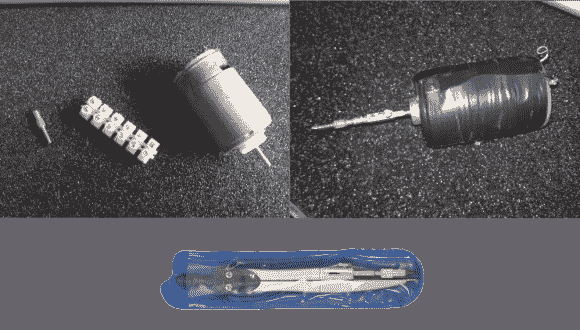

# DIY 迷你钻会让疯狂的麦克斯骄傲

> 原文：<https://hackaday.com/2014/03/16/diy-mini-drill-would-make-mad-max-proud/>

那上面不是监狱纹身枪，是 DIY 迷你钻。Hackaday 最近有点 DIY 工具的味道——有[简易锯](http://hackaday.com/2014/02/20/scrappy-lil-circular-saw/)、[研磨机](http://hackaday.com/2014/03/12/tiny-improvised-grindersaw-packs-a-punch/)和[研磨机转换成锯](http://hackaday.com/2014/03/04/russian-man-builds-a-chainsaw-out-of-a-grinder/)等等。不过，我们还没有任何 DIY 练习。[Szabolcs]需要一个钻孔机来安装他自制的印刷电路板。通常使用 Dremel 或类似的旋转工具来钻 PCB。然而，由于某种原因，他没有得到一个。[Szabolcs]召唤他内心的 MacGyver，用他手头的零件做了一个钻头。

每台钻机都需要一个卡盘，或者至少是一个夹头。这个钻头的卡盘来自一个[制图罗盘](http://en.wikipedia.org/wiki/Compass_(drafting))。很久以前，在 CAD 出现之前的黑暗时代，机械图纸是手工绘制的。公司雇佣整个制图部门来绘制设计、蓝图和图表。这些绘图员用指南针画出精确的圆和弧。[Szabolcs]重复使用指南针上的铅夹作为钻子的夹头。一个 540 或 550 刷封端罩电机，常见于 R/C 车旋转钻机。我们最初认为[Szabolcs]使用安装机或 Meccano 套件作为联轴器。事实上，这是欧式端子板的内部结构。一个小的触觉按钮被用来启动马达。一些缠绕在马达上的绝缘带将按钮固定在适当的位置。胶带还可以确保用户不会被包在罐子周围的金属片场环割伤。该系统的电源几乎可以来自任何地方，尽管[Szabolcs]说他使用的是旧 ATX 电源的 12v 轨道。