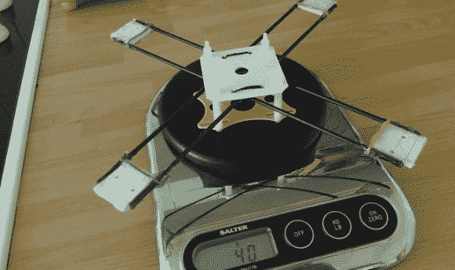

# DIY 迷你四轴飞行器框架轻巧坚固

> 原文：<https://hackaday.com/2013/10/28/diy-mini-quadcopter-frame-is-light-and-strong/>

[Oscar]最近一直忙于建造 DIY[迷你四轴飞行器](http://blog.oscarliang.net/diy-mini-quadcopter/)。本月早些时候，我们看到了[的控制器设计](http://hackaday.com/2013/10/04/a-diy-solution-for-controlling-robots-and-quadcopters/)。那时候他正把它用于他的步行机器人设计中。现在[奥斯卡]已经贴出了一些关于他的四轴飞行器工作的信息。尽管[Oscar]对迷你四轴车还不熟悉，但他已经开始设计自己的车架了。他用著名的 949 框架的简化版开始了他的框架设计。[Oscar]选择聚苯乙烯作为他的马达支架，这最终导致了车架的倒塌。事实证明，聚苯乙烯太脆弱，无法承受发动机和支撑物的振动。振动被传输到加速度计，这导致了一个非常难以控制的模型。你可以在休息后的第一个视频中看到这一点。

对于他的第二次尝试，[Oscar]从 HobbyKing 的一个经过验证的设计开始。HobbyKing 的玻璃纤维迷你四轴飞行器框架很坚固，但是很重，而且更换起来很贵(如果零件还有库存的话)。不过这个框架确实有用，所以他把它作为自己第二个 DIY 框架的起点。新的框架是基于玻璃纤维轴。[Oscar]使用热熔胶将轴连接到电机支架上。每个关节都用细绳包好，然后涂上热胶水。我们建议将来在这些类型的接头上使用薄的氰基丙烯酸酯胶。只有几滴钙渗入琴弦，形成一个非常轻而坚固的接头。[Oscar]的框架最终只有 HobbyKing 框架的一半重量，但对于成功的飞行测试来说足够坚硬，正如在休息后的第二个视频中可以看到的那样。

[https://www.youtube.com/embed/dH-KQ9tBYkc?version=3&rel=1&showsearch=0&showinfo=1&iv_load_policy=1&fs=1&hl=en-US&autohide=2&wmode=transparent](https://www.youtube.com/embed/dH-KQ9tBYkc?version=3&rel=1&showsearch=0&showinfo=1&iv_load_policy=1&fs=1&hl=en-US&autohide=2&wmode=transparent)

[https://www.youtube.com/embed/vlwFgO_4Mv0?version=3&rel=1&showsearch=0&showinfo=1&iv_load_policy=1&fs=1&hl=en-US&autohide=2&wmode=transparent](https://www.youtube.com/embed/vlwFgO_4Mv0?version=3&rel=1&showsearch=0&showinfo=1&iv_load_policy=1&fs=1&hl=en-US&autohide=2&wmode=transparent)