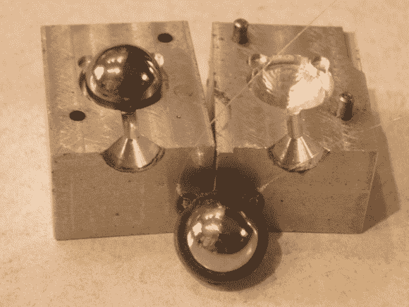

# DIY 牛顿摇篮使用智能手机上设计的部件

> 原文：<https://hackaday.com/2014/06/06/diy-newtons-cradle-uses-parts-designed-on-a-smart-phone/>

就物理演示而言，牛顿的摇篮可能是最容易辨认的之一。以艾萨克·牛顿爵士命名的“牛顿摇篮”使用摆动滚珠轴承演示了动量守恒定律。

[Scorchworks]决定他要[建造自己的](http://www.scorchworks.com/Blog/newtons-cradle/ "DIY Newton's Cradle")牛顿摇篮。该框架似乎是从中密度纤维板或碎料板切割而成，然后用螺丝固定在一起。这种材料很容易获得，也很容易用便宜的工具来处理。棘手的部分是滚珠轴承。大多数时候，当你看到一个牛顿摆时，滚珠轴承的顶部有一个小孔，上面有一个眼钩。然后将绳子系在吊环上。

[Scorchworks]决定做一些不同的事情。他的计划是制造定制的注塑塑料圈，完美地套在滚珠轴承上。最有趣的是，他在孩子的棒球练习中，完全在他的智能手机上设计注塑板。为了做到这一点，[Scorchworks]使用了他自己的 Android 应用程序， [ScorchCAD](http://www.scorchworks.com/ScorchCAD/scorchcad.html "ScorchCAD") 。ScorchCAD 是 OpenSCAD 的免费克隆版，设计用于在 Android 设备上运行。OpenSCAD 的大部分功能已经在 ScorchCAD 中实现，尽管还不是所有的功能都能工作。你可以在[项目的网站](http://www.scorchworks.com/ScorchCAD/scorchcad.html "ScorchCAD")或 [Google Play 商店](https://play.google.com/store/apps/details?id=com.scorchworks.scorchcad "ScorchCAD")找到所有支持功能的列表。

一旦在 ScorchCAD 中设计了板，[Scorchworks]导出 STL 文件，然后使用 [Meshcam](http://www.grzsoftware.com/ "Meshcam") 为他的 CNC 铣床生成 gcode。一旦他把板加工好，他就把滚珠轴承放入模具中，并在它周围注射熔化的塑料。塑料在轴承周围形成了一个形状完美的环，并带有小绳圈。[Scorchworks]重复这个过程几次，以完成所有的滚珠轴承。

最后，轴承用一些钓鱼线吊起来。牛顿摆对滚珠轴承的位置非常敏感。为了解释这一点，[Scorchworks]将钓鱼线的两端绑在支架顶部的两个不同的螺丝上。这样，每个螺丝可以拧紧或松开，以调整每个滚珠轴承的位置。