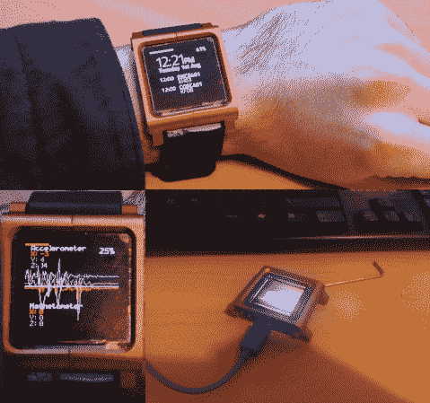

# DIY 有机发光二极管智能手表

> 原文：<https://hackaday.com/2014/07/07/diy-oled-smart-watch/>

有什么比自己做智能手表更好的？用有机发光二极管显示器做一个。这正是[贾里德]开始用他的 DIY 有机发光二极管智能手表做的事情，它结合了令人印象深刻的构造和一些非常酷的硬件。

当制作一个 DIY 智能手表时，获得正确的硬件可以说是最难的部分。经过几次迭代，【贾里德的】有机发光二极管智能手表全部包装好了，看起来棒极了！他的手表的固件可以通过 USB HID(不需要驱动程序)与 PC 通信，包含一个用于显示时间的“表盘”，包括一个集成的日历，并支持加速度计。他的文章还包括所有的固件，并进入一些建设细节。随着最近[智能手表](http://hackaday.com/2014/02/16/fixing-the-unfixable-pebble-smartwatch-screen-replacement/)和[可穿戴](http://hackaday.com/2014/01/12/squarewear-2-0-a-wearable-opensource-arduino/)电子产品的流行，我们真的很喜欢看到功能性的 DIY 版本。这只是开始。在未来，[Jared]计划增加蓝牙低能耗(BLE)、磁力计、智能睡眠闹钟等等！所以一定要看看他的[两篇](http://jared.geek.nz/2013/may/oled-watch)更老的[帖子](http://jared.geek.nz/2013/oct/oled-watch-rev-2)，并关注这个项目的进展。是一款非常有前景的智能手表！

随着 [Android L](http://developer.android.com/preview/index.html) 包括对智能手表的支持(在不久的将来)，看到 [DIY 手表](http://hackaday.com/2014/02/17/make-your-own-smart-watch/)(比如这款)被修改为运行新的移动操作系统将会令人惊讶。拥有一个运行如此强大(类似开源)操作系统的开放硬件平台该有多好？可能性是无限的！