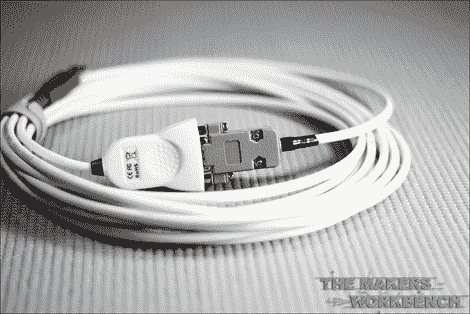

# DIY PC 到望远镜的接口电缆

> 原文：<https://hackaday.com/2013/03/22/diy-pc-to-telescope-interface-cable/>

如果你现在对天文学很认真，你会想要一台电脑控制的望远镜。虽然你可以很容易地买到连接两个设备的预制电缆，但这有什么意思呢？[Charles]是一个狂热的制造者，他制作了一个很好的分步指南，这样你就可以制作自己的。

这是一个很棒的周末项目，即使是一个电子爱好者新手也应该能够解决。这很简单，很快，也很容易。剥去电缆两端的绝缘层，然后剪掉不需要的电线。(你只会和他们中的三个人一起工作。)用热缩管准备好一切。将导线的一端压接到 RJ10 插头中，然后将导线的另一端焊接到 DB9 连接器中。将热缩管固定到位，连接外壳，您就可以称之为完成了！

[查尔斯]说整个过程只花了他大约 15 分钟。总成本？不到 17 美元的零件。