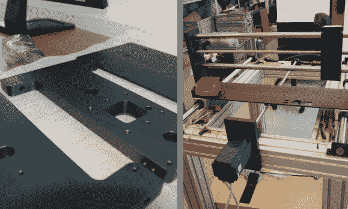

# DIY 拾取和放置刚刚开始

> 原文：<https://hackaday.com/2013/07/22/diy-pick-and-place-just-getting-under-way/>

说这个项目刚刚开始是不完全公平的。但事实是，它既没有选择也没有位置，所以还有很长的路要走。但我们对[丹尼尔·阿默斯伯格]迄今为止所取得的成就印象深刻。他用最简单的数控铣床[完成了设备的框架和门架](http://amesberger.wordpress.com/2013/07/18/diy-pick-and-place-machine/)。你可以看到左边的一些零件经过阳极氧化处理，留下光滑的黑色表面。

演示视频展示了通过操纵杆驱动该设备。它的速度很快，这让我们有希望与一些低端商业取放机相媲美。他已经在开发软件，该软件可以在迷你 ITX 电脑上运行。这包括一个 gerber 文件解释器和一些用于目视检查零件位置的计算机视觉。他还没有抽出时间来建立零件进料器，但我们会让你更新，因为我们听到他回来了。

[https://www.youtube.com/embed/qY62eLBNlYw?version=3&rel=1&showsearch=0&showinfo=1&iv_load_policy=1&fs=1&hl=en-US&autohide=2&wmode=transparent](https://www.youtube.com/embed/qY62eLBNlYw?version=3&rel=1&showsearch=0&showinfo=1&iv_load_policy=1&fs=1&hl=en-US&autohide=2&wmode=transparent)