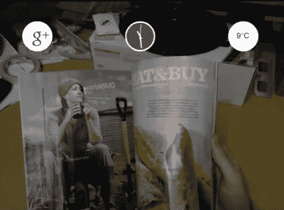

# DIY“玻璃项目”克隆看起来好得难以置信

> 原文：<https://hackaday.com/2012/04/11/diy-project-glass-clone-looks-almost-too-good-to-be-true/>

到目前为止，我们假设你们都熟悉谷歌的“眼镜项目”，这是一个雄心勃勃的增强现实项目，他们上周公布了一个宣传视频。[威尔·鲍威尔]看了宣传片，深受启发，他试图在家里为自己制作一个谷歌眼镜项目的演示。

虽然这看起来是一个令人生畏的项目，但[威尔]在基于 Kinect 的增强现实方面做了很多工作，所以他的 vu zix/高清网络摄像头/Dragon Naturally Speaking mashup 并没有超出他在工作中所做的一大步。正如你在下面的视频中看到的，他实现的界面看起来非常像谷歌在他们的演示中展示的界面，以类似的方式响应他的语音命令。

他说这段视频是“实时”录制的，尽管有很多人质疑这一说法。我们猜测他录制了输入 Vuzix 眼镜的视频流，而不是录制眼镜中显示的内容，这最有意义。

我们不愿意认为视频是伪造的，主要是因为我们希望看到谷歌遇到一些良性竞争，但你可以自己决定。

[https://www.youtube.com/embed/33wOKBMA2QA?version=3&rel=1&showsearch=0&showinfo=1&iv_load_policy=1&fs=1&hl=en-US&autohide=2&wmode=transparent](https://www.youtube.com/embed/33wOKBMA2QA?version=3&rel=1&showsearch=0&showinfo=1&iv_load_policy=1&fs=1&hl=en-US&autohide=2&wmode=transparent)