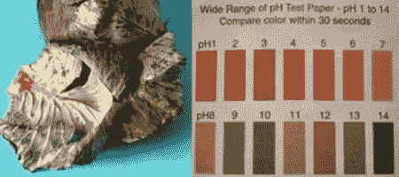

# DIY 科学——酸碱天然指示剂

> 原文：<https://hackaday.com/2012/05/16/diy-science-acidbase-natural-indicators/>

几乎[HAD]的所有东西都至少以某种方式基于科学。然而，如果你想用家里的东西做一些实际的科学实验，[【观察博客】](http://www.observationsblog.com/sciencetechnologyexperiments.html "Observations blog")可能适合你。

[Ken]写给我们的具体帖子都是关于酸、碱和天然指示剂的。在他的第一篇文章中，他回顾了酸、碱的一些定义，以及 pH 值的确切含义。对于那些忘记了高中(或大学)化学课的人来说，这是一个很好的复习工具。

另外两篇文章是关于制作你自己的天然酸碱指示剂。第一种叫做花青素，可以从红甘蓝中提取。相当具体的方向可以在这里找到[。类似的](http://www.observationsblog.com/4/post/2012/04/anthocyanin-ph-indicator-from-red-cabbage.html "anthocyanin indicator")[指示](http://www.observationsblog.com/4/post/2012/05/turmeric-curcumin-ph-and-an-art-deco-chicken.html "Tumeric indicator")也可以被发现将印度香料【姜黄】变成一个指示器。虽然这些概念可能不会帮助你制造下一个机器人，但它们很容易~~被复制~~为一个伟大的科学展览项目激发年轻的头脑！