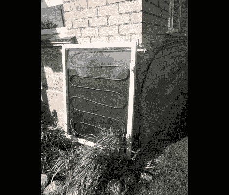

# DIY 太阳能集热器提升你的热水系统

> 原文：<https://hackaday.com/2012/05/24/diy-solar-collector-boost-your-hot-water-system/>

这个家在冬天用一个木头炉子取暖，也能产生热水。但是其他三个季节都是电热水器在工作。这项最新的技术是太阳能集热器，旨在接管房屋的热水生产工作。它使用基本的建筑材料和基本的建筑技术，这使得它比试图用太阳能发电更容易实现。

它实际上只是一个带玻璃盖的木头盒子。内部被漆成黑色，蜿蜒穿过的黑色管道盛水。一个三通阀可以让房主接入热水储水池。集热器比水箱低，所以当冷水代替热水时，热水会流回水箱。对于一个完全被动的系统来说还不错！

[谢谢你的记忆]