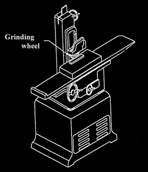

# DIY 平面磨床，在家制作精密零件

> 原文：<https://hackaday.com/2015/03/13/diy-surface-grinder-for-making-precision-parts-at-home/>

平面磨床是一种机器，它能使零件表面非常平整、光滑，并与安装在机器上的零件表面非常平行。平面磨床通常有一个悬挂在移动床上的旋转砂轮。床身在砂轮下来回移动零件，一次去除极少量的材料，有时只去除万分之一英寸(0.0001 英寸)，以制造精密零件。

[Daniel]是一名工具工，想要一台平面磨床。他不需要超级精确的商业磨床，所以他决定[自己做一台](http://www.hossmachine.info/projects_4.html#surface%20grinder)。这是一个了不起的项目，由相当多的其他工具组成。[Daniel]已经有了一台迷你数控铣床，并决定这将是一个很好的平台。毕竟，这个工厂是刚性的，并且已经有了自动化的 X 轴和 Y 轴。对于磨床电机来说，没有什么比使用普通角磨机更经济的了，但是有两个重要的问题。首先，没有一家公司为角磨机制造宽砂轮。[丹尼尔]必须修改他的主轴，以接受现成的表面砂轮。第二个问题是新砂轮的最大转速为 4400 转。角磨机可以达到 10600 转。为了降低角向磨光机的速度，速度控制从旧的变速刳刨机中取出，并与角向磨光机集成在一起。问题解决了。然后制作一个支架，将角磨机连接到研磨机的 Z 轴上。

安装在机床上的磁性卡盘用来压住金属工件。卡盘上有一个杠杆，当向一个方向移动时，它会产生一个磁场，在加工过程中将一块含铁的金属牢牢地固定在卡盘上。当操纵杆向另一个方向移动时，零件被释放，可以从平面磨床上取下。

为了使用他的新平面磨床，[Daniel]创建了一个 CNC g 代码文件，以便在砂轮下来回移动工件。能够用他的 CNC 机床控制切割深度和进给速度消除了磨削过程中的人为错误，并在零件上留下一致的光洁度。休息之后请看视频。

[https://www.youtube.com/embed/QIg1qC3wl-E?version=3&rel=1&showsearch=0&showinfo=1&iv_load_policy=1&fs=1&hl=en-US&autohide=2&wmode=transparent](https://www.youtube.com/embed/QIg1qC3wl-E?version=3&rel=1&showsearch=0&showinfo=1&iv_load_policy=1&fs=1&hl=en-US&autohide=2&wmode=transparent)