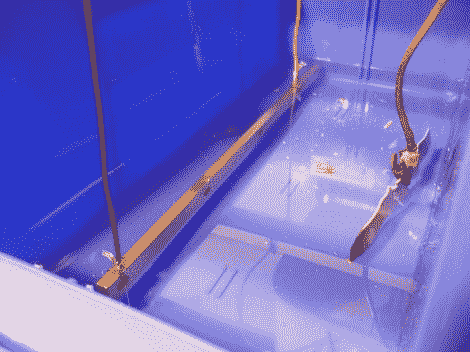

# DIY 母线镀锡

> 原文：<https://hackaday.com/2012/10/14/diy-tin-plating-for-bus-bars/>

铜汇流条通常用来代替导线来传输大电流。[Dane]为了一个项目需要一些母线，但是他担心腐蚀。他的解决方案是给汇流条镀锡，以降低腐蚀的风险，同时保持高导电率。

这个过程只需要两种化学物质:盐酸和锡。电解液是通过将锡溶解在酸中制成的。然后将汇流条放入稀释溶液中，让 1 A 的电流流过。结果是在铜上形成一层薄薄的锡层，在水中不会腐蚀。

[Dane]提到他想在未来尝试银焊料的工艺，因为它比锡更容易找到。他还想找到一种方法来测量沉积在母线上的锡量。这一过程可能有助于任何人谁需要一些耐腐蚀的大电流导体。

休息之后，请观看电镀过程的视频。

[//player.vimeo.com/video/48639930](//player.vimeo.com/video/48639930)