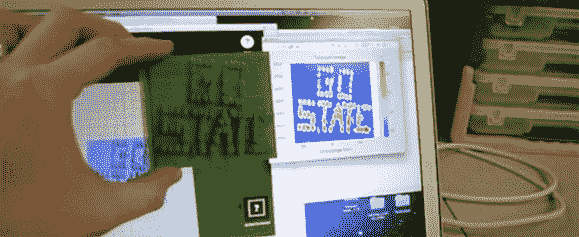

# DIY 超宽带脉冲合成孔径雷达和 MakerBot

> 原文：<https://hackaday.com/2014/05/07/diy-ultra-wideband-impulse-synthetic-aperture-radar-and-a-makerbot/>

还有什么比在 MakerBot 上打印出一些低分辨率的体素更好的呢？很多事情，但是用你自己的合成孔径雷达来获得那些体素[怎么样？这就是[Gregory Charvat]一直在做的事情，他为我们记录了整个过程。](https://www.youtube.com/watch?v=LDFxPufmq2E)

建造始于[我们不久前看到的超宽带脉冲雷达](http://hackaday.com/2013/10/05/homebuilt-ultra-wideband-impulse-radar/)。雷达是由[Greg]在易贝上收集的碎片建造的，能够在时域中成像场景，当[Greg]在喇叭前运行时，在 MATLAB 绘图上创建良好的线性扫描。

在他的腰带下有一个脉冲雷达，[格雷格]在技术阶梯上向上移动，用他的装置可以产生模糊可理解的图像。合成孔径雷达是把他的雷达喇叭放在车库开门器的支架上制成的。喇叭沿着直线轨道缓慢地来回扫描，获取单个脉冲读数，并将它们加在一起形成图像。在下面的视频中，[Greg]能够对几根直径只有几英寸的铜管进行成像。这个建筑的必要设备在代顿会议上只花了几百美元，而一个类似的设备甚至可以花更少的钱组装起来。

如果建造一个 X 波段脉冲合成孔径雷达还不够令人印象深刻。[格雷格]还在 MakerBot 上 3D 打印了他的一张雷达图像。这只是将 [stlwrite](http://www.mathworks.com/matlabcentral/fileexchange/20922-stlwrite-write-binary-or-ascii-stl-file) 应用于 2D 雷达图像，并将其输入 MakerWare。多伊，一定要有博客信誉。这也是我写过的最好的标题。

[https://www.youtube.com/embed/hKRHulDsSfE?version=3&rel=1&showsearch=0&showinfo=1&iv_load_policy=1&fs=1&hl=en-US&autohide=2&wmode=transparent](https://www.youtube.com/embed/hKRHulDsSfE?version=3&rel=1&showsearch=0&showinfo=1&iv_load_policy=1&fs=1&hl=en-US&autohide=2&wmode=transparent)

[https://www.youtube.com/embed/LDFxPufmq2E?version=3&rel=1&showsearch=0&showinfo=1&iv_load_policy=1&fs=1&hl=en-US&autohide=2&wmode=transparent](https://www.youtube.com/embed/LDFxPufmq2E?version=3&rel=1&showsearch=0&showinfo=1&iv_load_policy=1&fs=1&hl=en-US&autohide=2&wmode=transparent)