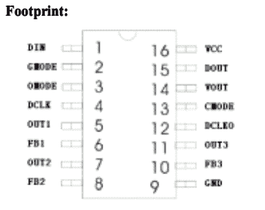

# 记录记录不良的 LED 灯条

> 原文：<https://hackaday.com/2015/04/12/documenting-poorly-documented-led-strips/>

当[Drew]在中国参加危险原型黑客训练营时，他买了一些非常亮、非常闪亮、非常便宜的 LED 灯条。它们是 5 米长的“5050”12V 灯条，每米有 20 个发光二极管，每卷大约 15 美元。在查看控制器的数据手册之前，您可能会认为这是一笔不错的交易。如果你想要一个不记录某事的例子，这就是。

一个正常人会对这些文件犹豫不决，而[Drew]却决定摆弄这些纸条。他找到了控制它们的方法，他的努力肯定会帮助数百人寻找明亮、闪亮、发光的东西。

You are expected to tell the difference between ‘GMODE’, ‘OMODE’ and ‘CMODE’ in this pinout.

此条中 LPD6803 控制器的数据手册—[可从 Adafruit here](http://www.adafruit.com/datasheets/LPD6803.pdf) 获得——非常有趣。芯片按照绿色、红色和蓝色的顺序接收时钟数据。如果有人能解释为什么不是 RGB，请说出来。选择的措辞包括，“VOUT 是输出极的饱和电压”和“这对以后芯片内置的 PLL 更新电路能否正常工作很重要。”显然,“颜色”一词在该数据表翻译成的任何方言中都是“灰色”的意思。

尽管有这种蹩脚的语法，[Drew]还是想出了如何控制这个 LED 条。他最终用 LPC1768 Mbed 微控制器来驱动它，并用几个简单的动画制作了一个演示程序。你可以在下面看到一段视频。

 [https://www.youtube.com/embed/9ZWz8lr-Z2Q?version=3&rel=1&showsearch=0&showinfo=1&iv_load_policy=1&fs=1&hl=en-US&autohide=2&wmode=transparent](https://www.youtube.com/embed/9ZWz8lr-Z2Q?version=3&rel=1&showsearch=0&showinfo=1&iv_load_policy=1&fs=1&hl=en-US&autohide=2&wmode=transparent)