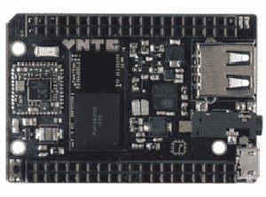

# Olimex 声称世界上第一台 9 美元的电脑售价 39 美元

> 原文：<https://hackaday.com/2015/06/11/does-the-worlds-first-9-computer-cost-9/>

Next Thing 公司的惠普宣称自己是世界上第一台 9 美元的电脑。那不是谎言；他们的 Kickstarter 花了 200 多万美元买了一台微型单板电脑，配有复合视频、WiFi、蓝牙 512MB 内存、4GB 存储空间和 1GHz CPU。那是一台完整的计算机，没有键盘、鼠标和显示器。35 美元的 Raspberry Pi 无法实现这一点——你需要添加一个 WiFi 适配器和一个 SD 卡来实现相同的功能——其他任何单板电脑都无法实现这一点。

可以理解的是，住房公积金已经非常成功了。它背后的公司有大约 50，000 份预订单，人们排队等待这款电脑，直到明年年初。Next Thing Co .究竟是如何设法制造出一台单板计算机并以 9 美元的价格出售的，这是一个有待回答的问题，也让不少人感到困惑。

Olimex 博客[给出了他们对 C.H.I.P](https://olimex.wordpress.com/2015/06/05/how-to-get-in-the-news-tell-people-that-you-will-make-and-sell-something-which-cost-you-20-for-9/) 的看法，如果这是可信的，那么这不是好消息。奥利梅克的人对制造便宜的单板计算机很在行；他们有不止几个可供销售，而且他们知道闪存和动态随机存取存储器市场是什么样子。对他们来说，以 9 美元的价格出售像 C.H.I.P .这样的电脑是不可能的。Allwinner 对类似模块的报价是 16 美元，这是 Next Thing Co .会考虑的数量。这只是一个带有内存和闪存的模块——没有 Wifi，没有主板，没有连接器。这台电脑怎么可能只卖 9 美元？

C.H.I.P., a small single board computer available for $9.

看过 Kickstarter 活动的人都可以给你一个答案。在建立社区方面，加州公共卫生协会是个失败者。一旦 C.H.I.P .开始发货，社区就变成了产品。低价位是一种经典的技巧，可以激发人们对项目的兴趣，并围绕项目建立一个社区。Kickstarter 上有数百个完全资助的项目可以证明这一点。

从商业角度来看，C . h . I . p . Kickstarter 甚至没有任何意义。C.H.I.P. Kickstarter 最初的目标只有 5 万美元。如果一家已经在销售硬件的企业无法找到投资者或获得贷款来开发新产品，那么两个现实中的一个必然是正确的:要么该产品是一个不可能实现的白日梦，没有投资者或贷款人会考虑，要么 Kickstarter 本身是一个建立社区的营销工具。

Next Thing Co .不同意 Olimex 的 39 美元索赔。在他们最新的活动更新中，他们说当预购开始时，加州理工学院的学费仍然是 9 美元。就 Next Thing 公司而言，他们并不担心竞争对手的猜测。Next Thing 公司的托马斯·德克(Thomas Deckert)说，“我可以告诉你，Olimex 的那篇文章至少有一个重大错误。”

C.H.I.P .的基本思想是利用现成的组件——你会在廉价的 Android 平板电脑和 value line 智能手机中找到的那种——将它们放在一块板上，然后运行一个 Linux 发行版。这是 Raspberry Pi 的基本前提，也是当今许多其他单板计算机背后的理念。从来没有一家公司用九美元就做到了。如果你相信他们的话，那就是 Next Thing 公司将要提供的东西。他们将如何做到这一点，谁也说不准，一旦这些微型、廉价的计算机开始发货，我们可能会学到很多关于供应链的知识，以及那些令人难以置信的芯片制造商到底能提供什么。在那之前，谁也说不准。