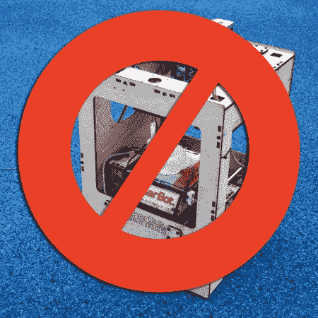

# 不要把你的 3d 打印机带到 MakerFaire

> 原文：<https://hackaday.com/2012/06/25/dont-bring-your-3d-printer-to-makerfaire/>

这很容易被称为“3d 打印机年”。他们出现在新闻中，出现在每个黑客空间，出现在每个事件中。这最后一个是我在这里要关注的。我们看到的所有报道以及我们的个人经历都表明，制造商云集，到处都是 3d 打印机。在 MakerFaire K. C .有太多的人，我都数不清了。我甚至懒得拍照，也懒得停下来看一会儿。虽然也有一些 repraps，但许多人是 makerbots。

如果你想在 MakerFaire 受到关注，不要把 3D 打印机作为唯一的展示。

我明白，你很激动。3d 打印*非常*令人兴奋。找时间问我对 3d 打印和未来的感觉，我会很高兴地与你讨论我认为它有多重要，以及我们如何看到一些伟大事物的雏形。然而，当你在创客博览会上展示你的黑客空间时，你需要展示你正在进行的*项目。不管你在你的黑客空间里建立了什么，展示一下吧。我知道你们中的一些人会提到*你们正在建造一台 3d 打印机*。酷，所有其他黑客空间也是，你最好也有一些其他的东西。你的 3d 打印机很可能和你旁边桌子上的没有什么不同。尤其是如果你买了一个 makerbot。超级特别是如果你旁边的桌子正好是 makerbot 桌子。*

我会告诉你需要带什么。仔细听，因为这很重要。想想你的黑客空间里的人。你有一个人或几个人对某事非常兴奋。对你来说可能看起来没什么特别的。它可能不会出现在 Make Magainze 的头条新闻中(还没有)，你可能也没有看到它在网上用花哨的网页出售。这个人/这些人在你看来可能是边缘人。某个古怪的人，一想到某种特殊的激光或特定类型的皮革加工，就会变得非常兴奋。带上那个人。让他们不停地谈论他们的特殊项目。他们的热情很有感染力。你的黑客空间会被记住。Hackerspace 的力量在于其员工的多样性以及他们对空间的利用。不要想着你的黑客空间给你的成员提供了什么，而是**展示你的成员给你的黑客空间提供了什么。**