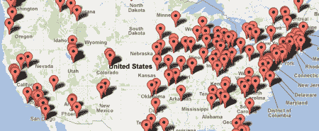

# 不要忽视中部！

> 原文：<https://hackaday.com/2012/07/26/dont-ignore-the-middle-of-the-country/>

“中西部什么都没有发生”。我就不说是谁说的了，但是绝对让我热血沸腾。我在 Hackaday 的时候已经听过好几次了。除了如此狂妄自大和不屑一顾，这也是完全不准确的。

有些人认为你绝对必须在海岸上才能成为任何有趣事物的一部分。在现代互联网时代，地理位置越来越不是问题。人们在世界各地的项目上合作。在 hackaday，我们每天都能看到从一个论坛衍生出来的项目，这个论坛将黑客与一个几乎没有中心地理点的共同主题联系起来。机器人、视频游戏、开源软件、工具和艺术装置都是从黑客文化中涌现出来的，不需要位于海岸上。

随着 3d 打印机等工具在黑客空间中变得普遍，物理设计方面的合作甚至正在地理上蔓延。你可以在阿肯色州的车库里，组装一台由明尼苏达州某个人设计的机器，并插入由堪萨斯州某个人上传的代码！

当然，我们都知道海岸很棒。高浓度的志同道合的人，以及文化，你可以找到任何地方靠近海洋。但是，请不要忽略中间，它让你听起来像过时的屁股。