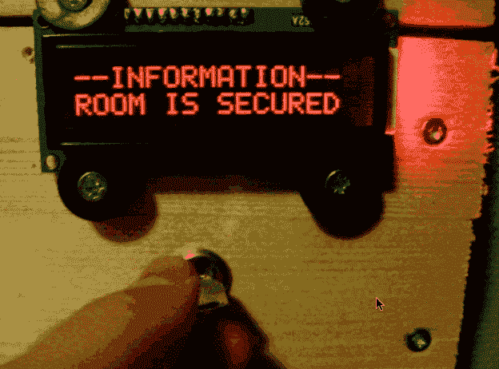

# 门锁提供实时安全，让您高枕无忧

> 原文：<https://hackaday.com/2014/07/14/door-lock-provides-peace-of-mind-with-real-time-security/>

[HSP]厌倦了用钥匙锁门，所以他决定升级到他自己设计的键盘系统。

它使用了一个 Arduino Mega，带有标准的 44780 显示屏、标准键盘和有趣的“按键覆盖”(如上所示)。锁定机构是一个标准的 12V 基于致动器的锁，通过软化内部的弹簧并将其颠倒运行(以便让重力帮助完成工作)，该锁被修改为仅使用 7.5V。整个系统待机功耗不到半瓦，锁定峰值功耗仅为 4-7W。

这个设计的真正巧妙之处在于他是如何从房间内部上锁的。他对 Arduino 进行了编程，将 1 写入 EEPROM 的地址 128——上电时，它将递增 1，5 秒钟后，它将重置为 1。这意味着它可以检测到快速的电源循环，所以你可以通过关闭它，打开它几秒钟，然后再关闭和打开它来锁门——他这样做是因为他不必在里面制作按钮或控制台或任何类型的无线控制。

现在我们知道这给系统的整体安全性增加了一个巨大的缺陷……但是[HSP]从上次构建“太”安全的东西中吸取了教训。

> 继电器板在外面墙上的盒子里面，锁只有通电才能锁。这是设计出来的不安全感。这是为了不让随便的人进来。门本身是薄木板，中间夹着硬纸板。我以前有一个锁，它在停电时被锁住，运行它的机器(Windows)崩溃了。我不得不爬过 7 米高的屋顶窗户，在不撞门的情况下进入室内，所以现在我有点担心故障的可能性，并根据预期的威胁级别设计我的系统。

[https://www.youtube.com/embed/eZj-wPOwu9c?version=3&rel=1&showsearch=0&showinfo=1&iv_load_policy=1&fs=1&hl=en-US&autohide=2&wmode=transparent](https://www.youtube.com/embed/eZj-wPOwu9c?version=3&rel=1&showsearch=0&showinfo=1&iv_load_policy=1&fs=1&hl=en-US&autohide=2&wmode=transparent)