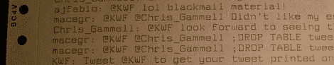

# 点阵打印机吐出任何提到@KWF 的推文

> 原文：<https://hackaday.com/2012/05/31/dot-matrix-printer-spits-out-any-tweet-mentioning-kwf/>

本月早些时候，[Kenneth]在硅谷跳蚤市场上捡到一台旧的点阵打印机，随后发现了两箱牵引式打印纸。这对点阵 twitter 打印机来说是天作之合。

[Kenneth]用一个[beagle bone](http://beagleboard.org/bone)——一台运行 Linux 的微型单板电脑——连接互联网，每分钟左右获取一条提到 KWF 的新推文。BeagleBone 通过 USB 端口发出这些推文，USB 端口通过廉价的适配器电缆连接到古老的打印机。

有趣的是，[Kenneth]把这个项目的代码写成了一个 shell 脚本。很多努力都花在清除任何转义字符的输入上，但他仍然恳求他的崇拜者不要试图破坏他的项目。

如果你想知道，当这篇文章发表的时候，有几个 Twitter 账户在 Twitterverse 上宣布了这篇文章的标题。这应该会立即让[Kenneth]的打印机开始工作，记录那个苛刻的女主人正在向 Hackaday 发送一个 Twitter 连接设备的构建日志。

休息之后你可以看到[Kenneth]的演示。一定要在 Twitter 上分享这个帖子！