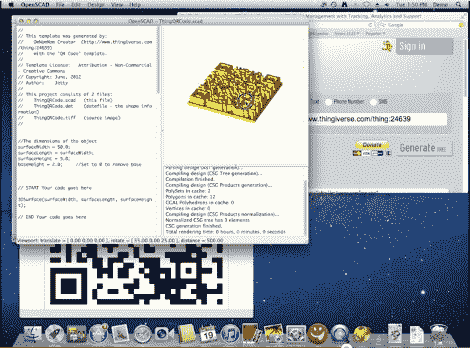

# 用于 3D 打印的拖放图像

> 原文：<https://hackaday.com/2012/07/19/drag-and-drop-images-for-3d-printing/>

这款名为 OmNomNom 的软件与 OpenSCAD [一起工作，将 2D 图像转换成 3D 模型](http://www.thingiverse.com/thing:24639)。这实际上是一个几乎即时渲染的拖放过程。

这里的例子是一个二维码，这是完美的软件，因为它是一个在源图像中定义良好的黑白轮廓。但是休息之后的视频展示了其他几个不依赖于这种简单性的例子。例如，使用四种不同颜色的超人标志很容易转换。还有一张被转换成 3D 物体的[贝多芬]半身像的深度图。同样的技术可以用于从地形源图像创建地形。

一旦文件被转换成一个模型，它仍然可以像正常的调整。这使您可以自定义大小和深度，以满足您的需求。这就是 OpenSCD 发挥作用的地方，但是如果你不使用该程序，你仍然可以直接从 OmNomNom 导出一个 STL 文件，用于你的 3D 打印机。

[https://www.youtube.com/embed/GEFzczYCRu4?version=3&rel=1&showsearch=0&showinfo=1&iv_load_policy=1&fs=1&hl=en-US&autohide=2&wmode=transparent](https://www.youtube.com/embed/GEFzczYCRu4?version=3&rel=1&showsearch=0&showinfo=1&iv_load_policy=1&fs=1&hl=en-US&autohide=2&wmode=transparent)