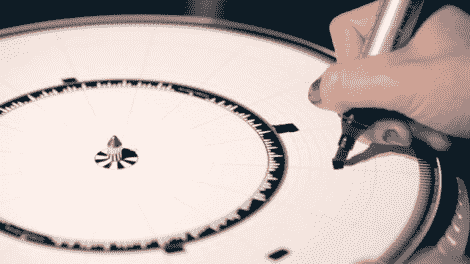

# 画出你自己的黑胶节拍

> 原文：<https://hackaday.com/2012/10/26/draw-your-own-vinyl-beats/>

Dyskograf 可以让你用一个魔法标记制作音乐。这个音乐装置看起来很像播放黑胶唱片的转盘。但是这不是一个包含声音的螺旋凹槽，而是使用一个纸盘上的标记来播放声音样本。

你可以在上面显示的纸碟上看到几个轨道的灯光轮廓。通过添加黑色标记，Dyskograf 的光学输入知道何时开始和结束每个声音。这在休息后的视频演示中得到最好的说明。

基于标记的设置很有意义，我们认为如果光盘是一个干擦板就更好了。比起另一个需要在黑胶唱片上钻孔来播放声音的光学转盘来说，它无疑更容易放下新的节拍。既然说到这个话题，你可能还会对[这个基于硬币的转盘音序器](http://hackaday.com/2009/10/15/turntable-sequencer-scratches-with-coins/)感兴趣。

[https://player.vimeo.com/video/51700038](https://player.vimeo.com/video/51700038)

[Thanks Petrus]