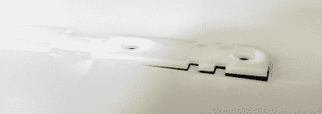
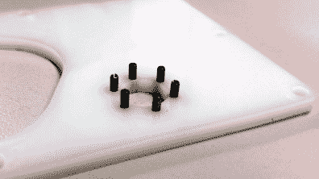
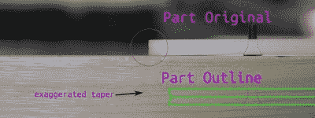

# 激光切割 Delrin 的缺点——以及如何避开它们

> 原文：<https://hackaday.com/2015/09/22/drawbacks-of-lased-delrin-and-how-to-slip-around-them/>

欢迎回到激光切割 Delrin 技术的第二部分。感谢评论中的许多真知灼见。在本指南中，我想回顾一下开始使用这种材料时想到的一些更直接的问题。

## 采购 Delrin 板材

说到购物，有各种各样的供应商可供选择，但有几个关键词和想法要记住。

### 名称

首先， *Delrin* ，是指缩醛均聚物的“品牌名称”。变体也可以被标记，*缩醛*或*缩醛* *均聚物。* Delrin 的天然颜色是柔和的白色，但染料可以将它染成一系列其他颜色。不过，到目前为止，黑色和白色是最常见的。

### 容忍

在之前的指南中，所有示例都是从来源于 [OnlineMetals](http://www.onlinemetals.com/merchant.cfm?id=206&step=2&top_cat=181) 的小范围板材厚度(0.0625【英寸】、0.09375【英寸】和 0.125【英寸】)上切割下来的。随着板材厚度的增加，厚度等级的公差也将变得更加宽松。你可能买了一个 0.125 英寸的盘子，发现它在一些地方是 0.124 英寸，而在另一些地方是 0.126 英寸。然而，如果你购买一张 0.250 英寸的纸，你会发现它可能会比原来大 0.126 英寸！

### 平买

尽管 McMaster-Carr 是我对一次性原型的首选解决方案，在这种情况下，快速构建迭代胜过 BOM 成本，但我不建议从他们那里购买 Delrin，因为他们的板材没有平坦度评级，并且经常在(奇怪尺寸的)箱子中弯曲运输。(说真的，以前有人在一个巨大的麦克马斯特盒子里得到过一些奇怪尺寸的零件吗？)

## 内部应力

挤出的 Delrin 在片材内部产生内应力。出现这种情况有多种原因，但我最大的预感是，工厂的挤出过程导致板材冷却时不同部分在不同时间固化，可能导致板材的一些部分在其他更粘的部分尚未完成冷却之前因冷却而变紧。这对你来说意味着，当你的零件被拉出来的时候，从某种意义上来说，你减轻了压力。因此，您切割的部分——尤其是薄板——可能会从激光切割机中略微弯曲。

假设首先放入激光切割机的板材是平的，那么你*可以*保证当零件展平时，孔和凹穴等特征将是正确的*相对距离*。为了在最终应用中展平零件，我提出了两个解决方案。

### 间隔叠加

因为孔的相对位置是精确的，你可以用螺栓把板固定在一起，使它们变平。

这是我在 GameCube-bot-2 的机箱中使用的方法。尽管每片的宽度和长度都有多个支架，但机箱作为一个整体会将所有的片拉平。

### "个人识别码分配"

或者，您也可以为弹簧销嵌入孔，并将两块板夹在一起，使销使两块板相对于彼此保持平坦，并消除它们的翘曲。嵌入在 Delrin 中的弹簧销还可以起到双重作用，因为您可以将 Delrin 板“折叠”起来以获得更厚的几何形状。下面，我把一些八分之一英寸的板折叠起来，以便更好地容纳一个法兰轴承。

    

## 可怕的锥度

唉，对于 40 到 60 瓦级别的 CO2 激光器，我们很难摆脱出现在所有部件边缘的这一特征。我所说的“锥度”指的是 Delrin(和其他一些)激光切割零件上出现的斜边。这种斜边是激光切割材料的一个特征。

如果我们想象光束聚焦成一个小点，就像我们通过放大镜燃烧纸张聚焦太阳光一样，那么不难想象准直光离开透镜时呈现的“锥形”形状。在焦点之外，这个圆锥体呈扇形散开成另一个圆锥体。这个“双锥”穿过我们的零件切削材料。取决于我们在切割前聚焦透镜的位置，这将决定透镜的形状——除非我们多次切割零件，每次切割的焦点不同。本着可重复性的精神，我将选择另一种变通方法。

完全避开这个问题几乎是不可能的，所以通常围绕它进行设计更容易。完全位于激光腔内的压配合零件，如轴承，通常在一端受到更紧的挤压，而不是在另一端。因此，它们可能会突然出现。为了解决这个问题，你可以选择它们的法兰对应物，或者将两个 Delrin 板夹在一起，相对的斜边可以更好地将零件固定在里面。

## 没有胶水！

Delrin 是出了名的化学惰性——以至于几乎不可能找到将 Delrin 粘合到另一个表面的胶水！虽然在这种情况下肯定有机会尝试将它融合在一起，但我要说，目前，粘合 Delrin 是可靠技术的最不可能的选择——尤其是在需要以某种方式发挥功能而不只是看起来漂亮的模型中。

## 公差严格的(重新)定尺寸孔

有时，孔需要*恰好*合适的尺寸，以适应金属与 Delrin 压配合的严格公差。在这种情况下，我们可以利用激光切割机的“更强大的部分”,并手动修改其余部分。在这种情况下，激光切割机在实现相对尺寸之间的紧密公差方面表现出色，例如孔之间的间距。另一方面，激光切割机并不擅长钉出公差严格的孔的精确尺寸。因此，我们可以缩小孔的尺寸，用激光将孔加工出来，最后用合适尺寸的钻头或铰刀将孔加工成最终尺寸。这是一点额外的工作，但它保证了某些孔可以满足更严格的公差限制。

## 平放储存

Delrin 在自重的作用下会弯曲。如果直立存放，随着时间的推移，它会弯曲，这使得激光切割机很难均匀切割，因为光束聚焦在距离镜头固定的距离。为了让你的 Delrin 侧边项目远离重力问题，我建议将床单平放。

## 仅仅是开始

感谢您收看这两部分的 Delrin 特别节目。不要忘记，虽然这些技术可能奠定了基础，但肯定有更多未记录的技巧值得用这些材料来尝试——这就是你的用武之地！如果你自己有任何发现，一定要在评论中告诉我们。作为一个社区，我们可以在不断推出项目的同时不断完善我们的知识库。