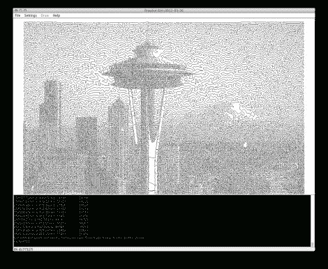

# Drawbot 软件的目标是比其他软件做得更好

> 原文：<https://hackaday.com/2012/07/27/drawbot-software-aims-to-do-it-better-than-the-rest/>

现在有很多 drawbot 项目，其中很多都附带了自己的特殊软件。虽然其中一些软件包比其他的更容易使用，但[丹·罗耶]很确定他能做得更好。

为了寻找一种有趣且吸引人的方式在全国各地的学校教授 STEM 课程，[Dan]开发了一个相对简单的 drawbot，它可以由各种年龄组的人构建。当他试图让学校购买他的机器人套件时，我们猜测我们的读者会更倾向于自己制作。

那么[丹]有什么能让你感兴趣的呢？嗯，他说他已经开发了一些非常容易使用的绘图机器人软件。他的软件将通过一个简单的步骤把你的照片转换成线条画，而不是由多个应用程序生成特定于机器的代码。该应用程序使用旅行推销员算法来生成没有交叉线的图纸，然后以易于使用的 GCode 输出最终的机器指令。

我们没有自己的 drawbot 来测试他的软件，所以如果你想试试，请在评论中告诉我们它是如何为你工作的。