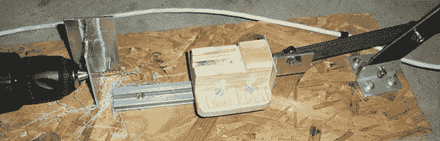

# 钻孔定制支架

> 原文：<https://hackaday.com/2014/01/30/drilling-custom-standoffs/>

每一个足够复杂的电子项目都需要支架——小小的塑料或金属圆柱体——来将电路板安装在一起。不过，保留数百个小塑料饰品并不真正符合黑客的心态:如果需要，保留一些 Delrin rod stock 来钻孔和切割支架会简单得多。[HomeCSP] [创造了一个装置来做这件事](http://www.instructables.com/id/A-Simple-Machine-for-Drilling-Stand-offs/?ALLSTEPS)，允许他把 1/4”Delrin 棒坯变成他需要的任何尺寸的支架。

在建造这个设备之前，[HomeCSP]将塑料棒带到钻床上，钻床上装有一个非常小的钻头，用于 2 号螺钉。这种技术的问题对任何人来说都是显而易见的。新的解决方案使用一个旧的无绳钻机和一个 6 英寸的线性轨道，有效地将一些废料变成一个固定钻头的水平钻床。

最终的结果是，一台机器可以沿着 1/4 英寸的钻杆直接钻孔。有了一盒螺丝，这些自制的塑料棒比现成的零件便宜得多，并且可以制成任何想要的长度。