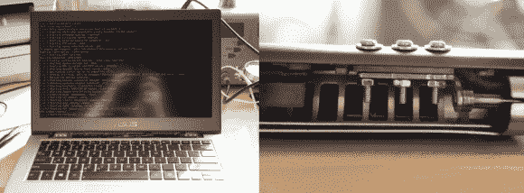

# 钻进笔记本电脑:极限铰链修复

> 原文：<https://hackaday.com/2014/03/22/drilling-into-a-laptop-extreme-hinge-repair/>

笔记本电脑公司在设计和美学上花费数百万美元，然后使用几乎肯定会坏掉的廉价铰链设计，这是怎么回事？在[彼得·佐托夫]花了几个小时试图在网上找到一个替代品后，他决定自己动手修理这个稍微有点非正统的铰链。

问题在于安装在盖子上的铰链的设计。首先，他们使用了非标准尺寸的螺丝，比 M2 略大。第二，它被拧进了铸铝中——更糟糕的是，它看起来甚至没有足够的螺纹啮合！一个好的经验法则是铝的螺纹直径的 2 倍，钢的 1-1.5 倍。不仅仅是华硕这样做，我们已经看到许多不同品牌的笔记本电脑在一年或两年后出现转轴故障——循环压力测试发生了什么？

无论如何，[彼得]决定钻出现有的螺纹，以适应更大的螺栓。他把他珍贵的笔记本电脑扔到他的数控铣床上(钻床也可以)，直接在盖子上打出更大的孔。这使得他可以用一个螺母和垫圈将三个标准的 M2 螺丝安装到位。我们承认这不是最优雅的解决方案，但它让他避免了仅仅因为公司计划淘汰而购买新笔记本电脑。