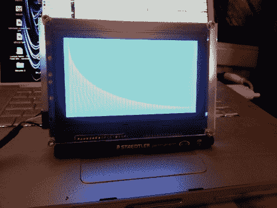

# 驱动基于 T6963C 的图形 LCD

> 原文：<https://hackaday.com/2012/04/23/driving-a-t6963c-based-graphic-lcd/>

[Tom Fleet]在[内度过了沉闷的周末，学习如何驾驶这款基于 T6963C 的图形 LCD 控制器](http://blog.tomfleet.com/?p=93)。虽然这是他第一次尝试脱离 HD44780 字符显示器，但 Arduino 库的可用性帮助他从一个新手变成了自己编写动画图形的人。

硬件设置非常简单。屏幕有一个 20 针连接器，工作电压为 5V。我们在他的原型板上看不到它，但通常这些显示器也需要一个电位计，作为屏幕对比度的分压器。数据和控制引脚耗尽了他使用的 ATmega328 芯片上的大部分可用 I/O，但 I2C 和 SPI 引脚仍然开放，他计划在未来的项目中使用这些协议之一为他的 PC 制作无线显示器。

至于字体和动画，[Tom]链接了几个有用的工具。有一个字体程序可以将 Windows 系统字体转换成 C 文件，以便在 Arduino 上使用。动画从 1:1 比例的动画图形开始，该图形是用他最喜欢的图像编辑软件绘制的。然后，他将这些转换成单色 bmp 文件，并使用 [bmp2c](http://sourceforge.net/projects/bmp2c/) 将每一帧转换成 C 数组。休息之后，有一个 7 秒钟的例子，可以作为他的项目的启动屏幕。

[https://www.youtube.com/embed/QbSiqLOXI4Q?version=3&rel=1&showsearch=0&showinfo=1&iv_load_policy=1&fs=1&hl=en-US&autohide=2&wmode=transparent](https://www.youtube.com/embed/QbSiqLOXI4Q?version=3&rel=1&showsearch=0&showinfo=1&iv_load_policy=1&fs=1&hl=en-US&autohide=2&wmode=transparent)