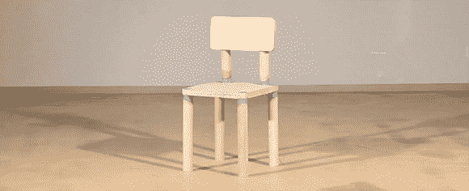

# DRM 椅子只能工作 8 次

> 原文：<https://hackaday.com/2013/03/04/drm-chair-only-works-8-times/>

从 iTunes 下载一首歌曲，您只能将该歌曲添加到其他五台电脑的音乐库。拿一份最新的微软办公软件，你最好希望你不会很快升级你的电脑。显然，DRM 对于公司来说是一个很好的工具，可以确保我们只按照预期使用软件和数据，但是除了计划淘汰之外，DRM 对于物理对象来说没有太多的用处。

这就是瑞士洛桑艺术与设计大学的一个团队介入的原因。他们设计了一把只能坐八次的椅子。之后，椅子会散架，需要购买新的椅子。在平板包装家具行业的某个地方，有人为没有早点想到这一点而自责，而另一个人则在想他们是如何让一把椅子用这么久的。

椅子的设计相当简单；椅子的所有关节都是用蜡浇铸的，蜡中嵌有一根镍铬合金线。一个带有小开关的 Arduino 会记录椅子被使用了多少次，而一个螺线管会在用户每次起身时记录下椅子还剩下多少次使用。当内部计数器达到零时，继电器通过镍铬合金线发送电力，融化蜡，并将椅子恢复到其原有的暗杆和木板形式。

熔化蜡并不是团队快速拆卸椅子的首选；他们的第一次实验使用了火药。这个想法几乎成功了，但是很快就意识到团队中没有人愿意坐在一个装满东西的椅子上。休息后可以看到蜡模失败的视频。

[https://player.vimeo.com/video/60475086](https://player.vimeo.com/video/60475086)[https://player.vimeo.com/video/60335141](https://player.vimeo.com/video/60335141)[https://player.vimeo.com/video/60342769](https://player.vimeo.com/video/60342769)