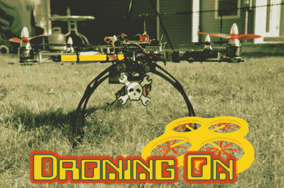
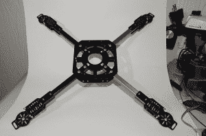
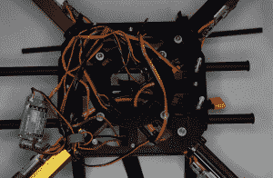
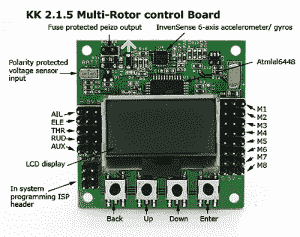
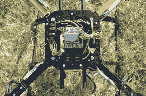
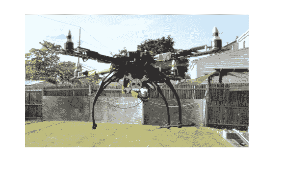

# 首航

> 原文：<https://hackaday.com/2014/08/28/droning-on-maiden-flights/>

当我们上次停止时，Hackaday 无人机测试平台只是工作台上的一箱零件。从那以后，事情发生了很大的变化！让我们直入主题吧。

随着武器的建立和速度控制焊接，这是一个简单的问题，螺栓框架本身在一起。HobbyKing 框架被设计成可折叠的，尼龙垫圈在玻璃纤维板上滑动。我真的不需要折叠功能，所以我锁定了 nylock 螺母，他们一直保持这种方式至今。随着手臂的安装，它终于开始看起来像一个四轴飞行器。

使用正确的螺丝，电机很容易拧入框架。我确实不得不在每个电机板上做一些锉削，以使电机的螺丝模式适合。速度控制没有具体的安装，所以我用双面胶带将它们固定在手臂的两侧，并使用一些拉链来确保没有东西移动。事后看来，我应该把它们安装在扶手的顶部，因为我打算把 LED 灯带放在四边的外侧。发光二极管将有助于定向，并确保在夜间飞行中看到一些不明飞行物。

配电是多机的一个主要问题。不知何故，你必须把主电池的能量提供给四个速度控制器、一个飞行控制器、一个电压调节器和任何附件。有多氯联苯，这在过去对我很有效。对于 Hackaday 测试平台，我决定使用[线束](https://www.hobbyking.com/hobbyking/store/__51091__5_5mm_Bullet_to_4_x_4_0mm_Multistar_ESC_Power_Breakout_Cable_US_Warehouse_.html)。这个马具实际上比它本身更麻烦。我不得不剥去焊点处的电线，为电压调节器添加连接。整个马具比需要的长了一点。在四边形的主体板之间有足够的空间容纳多余的电线，但所有这些铜都是多余的重量，“板凳”不需要承载。不过，这个设置确实有效。如果我需要减轻一点重量，我会改用 PCB。

点击休息时间阅读故事的其余部分。

Hackaday 测试台中使用的电子速度控制(ESC)包含线性调节器，具体来说就是可靠的 LM7805s。在 R/C 情况下，7805 通过三线伺服引线的电源线向接收器供电，其他两条线承载地和 PWM。

并联三个线性稳压器通常不是一个好主意，但这正是 ESC 设计人员所做的，最有可能降低成本。由于我们有 4 个 ESC，将所有东西连接在一起意味着 12 个平行的线性调节器分成四个三联体，每个三联体之间有几英寸的电线。那是导致灾难的原因！

线性调节器一般不能很好地配合。一个调节器将最终承担负载，要么过热，要么进入热关断状态。额外的热量对 PCB 另一侧以 30 安培运行的 fet 没有好处。我们会得到评论说“但是它对我有效”。但这是那种在 60%的情况下会起作用，然后毫无征兆地爆炸的事情之一。

在许多情况下，最好的做法是切断四根电源线中的三根，从剩余的 ESC 调节器运行接收器和飞行控制器。然而，在这种情况下，我们处理的是 4 芯脂肪电池。在我们需要的电流下将 16.8V 电池降至 5V 会超过调节器的热限制。安全的做法是使用外部调节器。我从 Hobbyking 选了一个[开关 DC-DC 转换器。它直接接入主电池，提供充足的电力。](https://www.hobbyking.com/hobbyking/store/__31991__Turnigy_5A_8_26v_SBEC_for_Lipo_USA_Warehouse_.html)

在这一点上，事情已经到了最后关头——毫不夸张地说。是时候连接飞行控制器和接收器了。Hackaday 测试平台将测试几个飞行控制器，从 KK 2.1.5 多翼机板开始。将飞行控制器与振动隔离是一个好主意，所以我使用 Kyosho Zeal 凝胶安装垫将其固定在顶板上。接收器用标准的双面泡沫胶带粘在它旁边。我使用 Spektrum 无线电系统进行这些早期测试，尽管我肯定会花一些时间使用流行的 openTX 软件和无线电。

我连接 RX 到 KK 板使用男性到男性伺服连接。一切都按照图表进行。BEC 插入 RX 的电池输入，然后通过伺服导线向 KK 板发送电力。ESC 导线插入 KK 电路板的 M1-M4 连接中。完成所有艰苦的工作后，终于到了给 quad 加电的时候了。再次，我保持发动机连接，但没有螺旋桨安装。

KK 董事会马上通知我它处于安全模式。KK 板上的按钮和 LCD 界面实际上非常容易使用。我能够进入伺服监视器，看到我的副翼、升降舵和方向舵通道都颠倒了。几个快速变送器设置更改纠正了问题。

我将电路板配置为 X 模式，并使用 KK 电路板直通模式校准 ESC。所有的马达都朝正确的方向旋转，一切似乎都准备就绪。是时候飞翔了！

对任何飞机来说，首航都有点令人伤脑筋。在这次飞行中，我将 KKbaords PI 值保持在默认值，所以我真的不知道我是否会面对一个反应缓慢的醉酒四轴飞行器，或者一只愤怒的摇晃的蜜蜂。在外面，我启动了马达，让它轻滑起来，刚好够验证控制输入。左棒使它向左倾斜，向前使它向前倾斜。一切看起来都很好，所以我推进油门悬停。Hackaday 测试平台进行了第一次起飞，实际上非常稳定。

我悬停在电池组外，切换 KK 板进出自我水平。PI 值肯定不是最佳的，因为四元感觉有点糊。尽管如此，这是一次非常成功的首次飞行！
