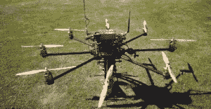

# 唠叨:资源和第一步

> 原文：<https://hackaday.com/2014/03/31/droning-on-resources-and-first-steps/>

最近几周无人机新闻很平静。一些商业团体的成员正在执行任务，而其他人则在等待联邦航空局对 NTSB 的上诉结果。不可否认，无人机作为一个行业正在变得越来越大。甚至脸书也加入了这场争论，不是为了让无人机递送真实世界的信息，而是为了在偏远地区提供互联网接入。

新闻中的一个亮点是一名八轴直升机操作员在犹他州沙漠发现了 2500 年前的岩画，即 T2 岩画。在探索一个已知的考古遗址时，GotAerial LLC 的 Bill Clary 驾驶他的 octocopter 飞到了一个悬崖表面。这种岩石结构会使顺流而下变得非常困难。他发现了一个惊人的岩画收藏[，并记录在这个视频](https://www.youtube.com/watch?v=V6J_6KL03s8)中。虽然岩画的真实性尚未被证实，但它们似乎可以追溯到大约从公元前 500 年到公元 860 年居住在该地区的[制篮人](http://en.wikipedia.org/wiki/Basketmaker_culture)。

也许你在问自己如何才能加入这些甜蜜的无人机冒险？无论你是在考虑你的第一次飞行，还是已经拥有多架飞机，你都会想要阅读我们关于入门(特别是:获得你的第一架无人机)和发现无人机相关社区的讨论。点击“阅读更多”链接和我们在一起。

**无人机，我自己的无人机:入门**

无人机入门应该比实际容易。正如任何复杂的努力一样，有一些常见的陷阱经常会阻碍爱好者。我看到的最大的一个例子是一名新飞行员购买并建造了一个昂贵的模型——无论是用于体育、航空摄影、FPV 还是全自动——而没有先学习如何飞行。这肯定会导致灾难。当出现问题时，几乎所有的自主模型都会依靠无线电控制。FPV 模型可以，也确实有视频故障，所以知道如何飞行的视线是至关重要的。就当是学开车吧。你不会想在科尔维特或劳斯莱斯上学习。这同样适用于无人机。不要用八轴直升机学习，或者用 2000 美元的摄影设备悬挂在你的航拍架上。

仅仅选择第一个四元组来学习就可能是一项艰巨的任务。早在 20 世纪 90 年代初，我在一家业余爱好商店工作。当时只有少数几家大型遥控玩具制造商。其中大部分位于美国、欧洲和日本。随着中国和全球经济的崛起，现在有数百家无人机和遥控模型的制造商和经销商。这导致了我们在 Arduino 和任何流行的电子设备上经常看到的“克隆的克隆的克隆”的情况。但是哪些型号质量还过得去，哪些是垃圾？想要得到一个好的答案，最简单的方法就是寻求别人的建议。

根据我自己的经验，我发现一种特殊的飞行器非常适合学习飞行。它也是最便宜的之一，这没有什么不好。[司马 X1](http://www.symatoys.com/product/show/1878.html) 是一个非常好的学习四重奏。司马似乎是一个复制的[叶片 MQX](http://www.horizonhobby.com/products/blade-mqx-bnf-BLH7580) 四轴飞行器——然而司马修复了 MQX 遭受的一些飞行问题。你可以在亚马逊和其他网上零售商那里买到 Syma，价格大约 30 美元。X1 是一个刷式四边形，这意味着电机使用碳刷将功率传输到线圈。大多数较大的四轴是无刷的。不要让旧技术愚弄你。有刷电机在这种应用中就很好。然而，我不喜欢 X1 的一个部分是发射机。虽然它有一个液晶显示屏，但棍子和整体动作感觉很廉价。他们不得不在某个地方省钱。即使有这样的缺点，司马发射机也很好学习。一个真正的好处是，X1 可以与非常容易破解的 [Turnigy 9x 系列发射机](http://www.hobbyking.com/hobbyking/store/__19673__Turnigy_9X_9Ch_Transmitter_w_Module_8ch_Receiver_Mode_2_v2_Firmware_USA_Warehouse_.html)配对。

订购时，不要忘记检查变送器的模式。模式 1/模式 2 指操纵杆上的控制布局。亚洲和欧洲倾向于使用模式 1，油门和副翼在右驾驶杆上。北美使用模式 2，油门和方向舵在左驾驶杆上。由于油门控制不使用定心弹簧，这是一种机械变化，而不仅仅是功能的软件重新映射。一种模式并不比另一种模式更容易飞行，但当你的收音机和朋友的功能相同时，和朋友一起飞行会更有趣。

虽然我不打算在学习飞行的教程上喋喋不休—[有很多高质量的教程(](http://www.dream-models.com/helicopters/FlightSchool)——但我想提供一些建议。

*   如果你要撞车了，踩油门。X1 非常轻，撞击通常不会造成损坏。当撞击发生时，确保马达关闭将会保护你的螺旋桨、齿轮和马达。
*   试着飞过草地或泥土，而不是水泥地。一些教程会告诉你在学习的时候在地面上滑行。打滑是对遥控直升机训练的一种倒退。对于像 X1 这样的小型四轴飞行器，最好离开地面几英尺，远离地面效应湍流。
*   如果你觉得你要失去控制，放开操纵杆——X1 上的陀螺仪和加速度计通常会让它回到水平悬停状态。
*   让无人机的背面朝向你。在这个方向上，无人驾驶飞机将跟随操纵杆的运动。当你对此感到满意时，尝试其他方向。
*   “机头向内”是最难掌握的方向，因为你的左边是四轴飞行器的右边。四轴飞行器会反映你的驾驶杆运动。
*   玩得开心！说真的——学习时很容易感到沮丧和紧张。如果发生这种情况，请稍作休息，并努力记住，即使它飞走了，X1 只需 30 美元即可更换。

**无人机资源**

我最喜欢互联网的一个方面就是协作。像业余无线电爱好者一样，遥控和无人机爱好者也是互联网的早期采用者。以前，新闻和信息一个月只能通过杂志获得一次，现在可以在网上即时获得。[新闻组](http://en.wikipedia.org/wiki/Usenet)通过 rec.models.rc 新闻组树提供早期访问。随着网络时代的到来，很多对话转移到了基于论坛的网站上。一些最古老和最丰富的资源是 R/C 论坛。最好的例子就是 [RC 集团](http://www.rcgroups.com/forums/index.php)。作为可追溯到 1995 年的电子 RC 杂志 [Ezone](http://www.ezonemag.com/) 的一部分，RC Groups 拥有这个爱好的几乎每个方面的版块。黑客读者会对[多旋翼](http://www.rcgroups.com/aircraft-electric-multirotors-790/)、 [FPV](http://www.rcgroups.com/aircraft-electric-fpv-861/) 、[航空摄影](http://www.rcgroups.com/aerial-photography-128/)、[无人机](http://www.rcgroups.com/uav-unmanned-aerial-vehicles-238/)和 [DIY 电子](http://www.rcgroups.com/diy-electronics-199/)部分感兴趣。

以下是一些其他面向遥控和无人机的论坛:

*   [RC 宇宙](http://www.rcuniverse.com/forum/)，类似 RC 群的通用 RC 论坛。
*   [FPV 实验室](http://fpvlab.com/forums/)涵盖第一人称视频爱好者。
*   [多旋翼论坛](http://www.multirotorforums.com/)涵盖了所有多旋翼的东西——从三翼飞机到八翼飞机等等。
*   [AP 登陆](http://www.aplanding.com/forums/forums.php)覆盖航拍民间。

请注意，这不是一个详尽的列表。我试图覆盖几个大网站。如果你知道我错过了什么，请写在评论里。

大多数论坛的问题是寻找信息。当然，他们有搜索，但他们通常会留下相当多的期望。例如，RC 群组上的主要[Sima X1 主题](http://www.rcgroups.com/forums/showthread.php?t=1797545)目前超过 5200 个帖子，跨越 348 页。话题迂回曲折，火药味十足，帖子的大小一发不可收拾。如果统计数据可信的话，RC Groups 在任何给定时间平均有大约 20，000 个活跃用户。这是可以理解的，即使是 mod 军队也很难跟上。

有很多基于非论坛的无人机信息网站。3D Robotics 在 DiyDrones 有一个社区网站，里面充满了论坛和博客信息。 [Instructables](http://www.instructables.com/howto/drone/) 有许多无人机条目。 [Hackaday.io](http://hackaday.io/) 的无人机部门看起来仍然很薄弱——尽管我们希望你能在不久的将来帮助改变这种状况。

这就是本期《唠叨不休》的全部内容！