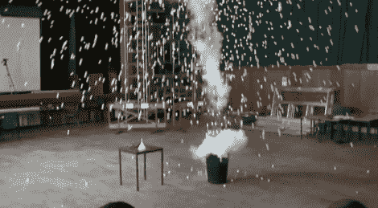

# 在科学课上扔氮气弹

> 原文：<https://hackaday.com/2012/09/20/dropping-the-nitrogen-bomb-in-science-class/>

我们在大学里学了地质学。了解不同矿物的硬度是一件非常酷的事情。但是没有爆炸。我们不完全确定这门课是什么，也许是化学，也许是物理，但我们想参加。罗伊·洛瑞博士用一枚液氮炸弹震惊了全班。该演示是他在 T2 普利茅斯大学演讲的一部分。

一个小爆炸很酷，但[罗伊]知道如何添加令人惊叹的因素。为了制造炸弹，他在一个 1 升的塑料瓶中填充了大约 1/3 的液氮。把盖子盖紧后，它被扔进了垃圾桶里，垃圾桶里有一池温水。在快速逃跑之前，他和他的助手在上面扔了几袋乒乓球。当塑料瓶在膨胀气体的压力下爆裂时，它会将垃圾桶送到大约 6 英尺高的空中，并用弹跳的白色球淹没房间。休息后，在剪辑中亲自观看整个演示，不要忘记声音，以便您可以在结束时听到“哦”和“啊”声。

如果我们见过的话，这看起来像是黑客空间的招聘工具。

[https://www.youtube.com/embed/JJ9yn8vLdig?version=3&rel=1&showsearch=0&showinfo=1&iv_load_policy=1&fs=1&hl=en-US&autohide=2&wmode=transparent](https://www.youtube.com/embed/JJ9yn8vLdig?version=3&rel=1&showsearch=0&showinfo=1&iv_load_policy=1&fs=1&hl=en-US&autohide=2&wmode=transparent)

[ [IO9](http://io9.com/5944687/scientist-+-liquid-nitrogen-+-1500-ping-pong-balls--boomhappy-funtime) 通过 [Reddit](http://www.reddit.com/r/geek/comments/105uq7/deleted_from_rscience_scientist_liquid_nitrogen/)